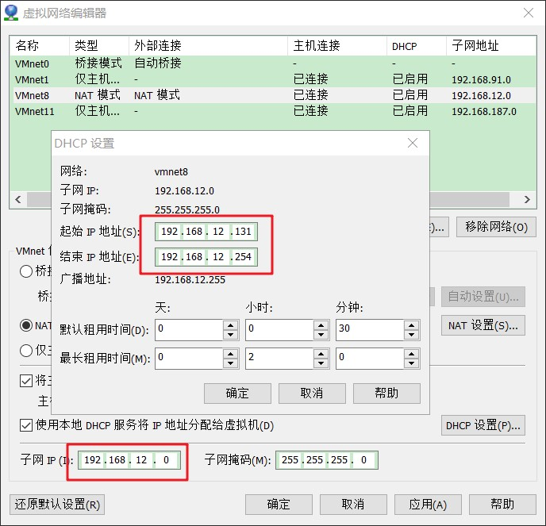
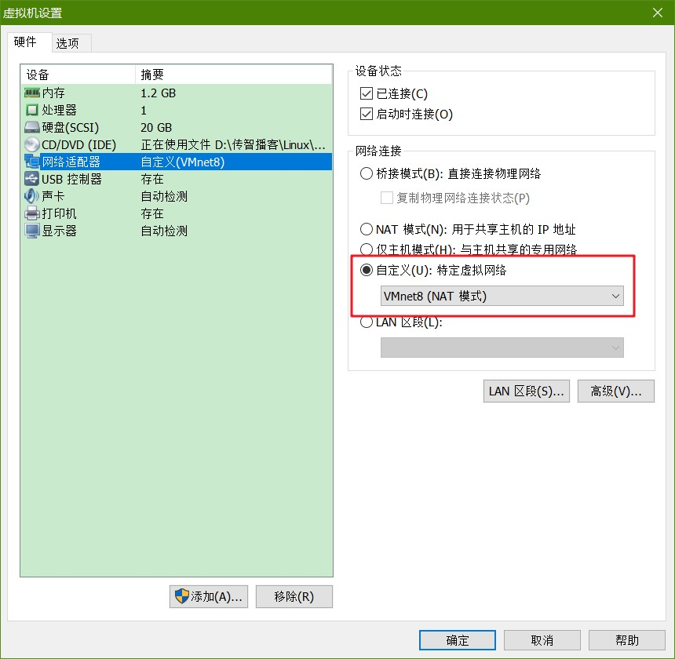

# 附录2：项目扩展知识

---

## 1. 项目过程涉及的其他知识
### 1.1. 虚拟机与本机网络连接设置





### 1.2. classpath两个配置
- 【classpath:】表示当前项目的根路径
- 【classpath*:】表示包括当前项目与依赖的项目的根路径

### 1.3. @Controller和 @RestController的区别？

官方文档：

`@RestController` is a stereotype annotation that combines `@ResponseBody` and `@Controller`.

意思是：

`@RestController`注解相当于`@ResponseBody` ＋ `@Controller`合在一起的作用。

1)如果只是使用`@RestController`注解Controller，则Controller中的方法无法返回jsp页面，配置的视图解析器InternalResourceViewResolver不起作用，返回的内容就是Return 里的内容。

例如：本来应该到success.jsp页面的，则其显示success.

2)如果需要返回到指定页面，则需要用 @Controller配合视图解析器InternalResourceViewResolver才行。

3)如果需要返回JSON，XML或自定义mediaType内容到页面，则需要在对应的方法上加上@ResponseBody注解。

### 1.4. 页面使用JSON.parse(),JSON.stringify()实现对对象的深拷贝

使用ajax向后台传递数据时，通常会传递json格式的数据，当然这里还有其它格式，比如xml、html、script、text、jsonp格式。

json类型的数据包含json对象和json类型的字符串

- `JSON.stringify()`：将JSON对象转换为JSON类型的字符串
- `JSON.parse()`：将JSON类型的字符串转换为JSON对象

### 1.5. @Reference注解的timeout属性

```java
// timeout: 连接服务超时的时长(xx秒)，防止因为机器连接反应过慢而连接超时
@Reference(timeout = 毫秒值)
```

### 1.6. JSON的几种解析方法
#### 1.6.1. 一、json-lib

json-lib最开始的也是应用最广泛的json解析工具，json-lib 不好的地方确实是依赖于很多第三方包，在Json.org网站上，Java可以使用的解析Json的组件就有21种之多。这里以使用org.json解析JSON为例。在读本文之前，读者有必要了解一下JSON的结构，这里不作介绍。

首先下载org.json源码，下载地址：

https://github.com/douglascrockford/JSON-java，点Downloads,Windows系统就选zip吧。当然你也可以用Git，只是我不太习惯那玩意。下载完后解压，在你的项目里新建一个名为org.json的包，把除README和Test.java以外的所有文件放入该包内(Eclipse只要拖进去就可以),现在我们就可以用org.json解析JSON.为了以后方便，你也可以把org.json这个包打成jar,在要用的项目上导入就行。

#### 1.6.2. 二、开源的Jackson

相比json-lib框架，Jackson所依赖的jar包较少，简单易用并且性能也要相对高些。而且Jackson社区相对比较活跃，更新速度也比较快。

Jackson对于复杂类型的json转换bean会出现问题，一些集合Map，List的转换出现问题。Jackson对于复杂类型的bean转换Json，转换的json格式不是标准的Json格式

#### 1.6.3. 三、Google的Gson

Gson是谷歌公司研发的。应用主要为toJson与fromJson两个转换函数，无依赖，不需要例外额外的jar，能够直接跑在JDK上。

而在使用这种对象转换之前需先创建好对象的类型以及其成员才能成功的将JSON字符串成功转换成相对应的对象。

类里面只要有get和set方法，Gson完全可以将复杂类型的json到bean或bean到json的转换，是JSON解析的神器。

Gson在功能上面无可挑剔，但是性能上面比FastJson有所差距。

#### 1.6.4. 四、阿里的Fastjson

Fastjson是一个Java语言编写的高性能的JSON处理器,由阿里巴巴公司开发。无依赖，不需要例外额外的jar，能够直接跑在JDK上。

FastJson在复杂类型的Bean转换Json上会出现一些问题，可能会出现引用的类型，导致Json转换出错，需要制定引用。

FastJson采用独创的算法，将parse的速度提升到极致，超过所有json库。

### 1.7. 使用SpringMVC - 配置FastJSON为JSON处理器
#### 1.7.1. spring配置文件

springMVC使用fastJson作为前端与返回的解析器，修改spring的配置文件中的`<mvc:annotation-driven>`内容

```xml
<!-- 启用默认配置 -->
<mvc:annotation-driven>
    <mvc:message-converters register-defaults="true">
        <!-- 配置Fastjson支持 -->
        <bean class="com.alibaba.fastjson.support.spring.FastJsonHttpMessageConverter">
            <property name="supportedMediaTypes">
                <list>
                    <value>text/html;charset=UTF-8</value>
                    <value>application/json</value>
                </list>
            </property>
            <property name="features">
                <list>
                    <value>WriteMapNullValue</value>
                    <value>QuoteFieldNames</value>
                </list>
            </property>
        </bean>
    </mvc:message-converters>
</mvc:annotation-driven>
```

#### 1.7.2. Fastjson的SerializerFeature序列化属性

- `QuoteFieldNames`：输出key时是否使用双引号,默认为true
- `WriteMapNullValue`：是否输出值为null的字段,默认为false
- `WriteNullNumberAsZero`：数值字段如果为null,输出为0,而非null
- `WriteNullListAsEmpty`：List字段如果为null,输出为[],而非null
- `WriteNullStringAsEmpty`：字符类型字段如果为null,输出为"",而非null
- `WriteNullBooleanAsFalse`：Boolean字段如果为null,输出为false,而非null


### 1.8. JavaScript 中 typeof 判断变量的类型

typeof 运算符返回一个用来表示表达式的数据类型的字符串。可能的字符串有："number"、"string"、"boolean"、"object"、"function"和"undefined"。

例：

- typeof的运算数未定义,返回的就是 "undefined".
- 算数为数字 typeof(x) = "number"
- 字符串 typeof(x) = "string"
- 布尔值 typeof(x) = "boolean"
- 对象、数组和null typeof(x) = "object"
- 函数 typeof(x) = "function"

## 2. 修改linux系统ip

```cmd
[root@localhost ~]# ifconfig ens33 192.168.12.131
[root@localhost ~]# i
```

## 3. MySQL优化

- 索引
- mysql执行计划
- 用exists取代in
- mycat分库分表

## 4. log4j 使用说明
### 4.1. Log4j基本使用方法

Log4j由三个重要的组件构成：日志信息的优先级，日志信息的输出目的地，日志信息的输出格式。日志信息的优先级从高到低有ERROR、WARN、 INFO、DEBUG，分别用来指定这条日志信息的重要程度；日志信息的输出目的地指定了日志将打印到控制台还是文件中；而输出格式则控制了日志信息的显示内容。

#### 4.1.1. 定义配置文件

其实可以完全不使用配置文件，而是在代码中配置Log4j环境。但是，使用配置文件将使您的应用程序更加灵活。**Log4j支持两种配置文件格式，一种是XML格式的文件，一种是Java特性文件（键=值）**。

##### 4.1.1.1. 配置根Logger

语法：

```properties
log4j.rootLogger = [ level ] , appenderName, appenderName, …
```

其中，level 是日志记录的优先级，分为OFF、FATAL、ERROR、WARN、INFO、DEBUG、ALL或者您定义的级别。<font color="red">**Log4j建议只使用四个级别，优先级从高到低分别是ERROR、WARN、INFO、DEBUG**</font>。通过在这里定义的级别，您可以控制到应用程序中相应级别的日志信息的开关。比如在这里定义了INFO级别，则应用程序中所有DEBUG级别的日志信息将不被打印出来。 appenderName就是指B日志信息输出到哪个地方。您可以同时指定多个输出目的地。

##### 4.1.1.2. 配置日志信息输出目的地Appender

语法：

```properties
log4j.appender.appenderName = fully.qualified.name.of.appender.class
log4j.appender.appenderName.option1 = value1
......
log4j.appender.appenderName.option = valueN
```

其中，Log4j提供的appender有以下几种

```
org.apache.log4j.ConsoleAppender（控制台）
org.apache.log4j.FileAppender（文件）
org.apache.log4j.DailyRollingFileAppender（每天产生一个日志文件）
org.apache.log4j.RollingFileAppender（文件大小到达指定尺寸的时候产生一个新的文件）
org.apache.log4j.WriterAppender（将日志信息以流格式发送到任意指定的地方）
```

##### 4.1.1.3. 配置日志信息的格式（布局）

语法：

```properties
log4j.appender.appenderName.layout = fully.qualified.name.of.layout.class
log4j.appender.appenderName.layout.option1 = value1
......
log4j.appender.appenderName.layout.option = valueN
```

其中，Log4j提供的layout有以下几种

```
org.apache.log4j.HTMLLayout（以HTML表格形式布局）
org.apache.log4j.PatternLayout（可以灵活地指定布局模式）
org.apache.log4j.SimpleLayout（包含日志信息的级别和信息字符串）
org.apache.log4j.TTCCLayout（包含日志产生的时间、线程、类别等等信息）
```

Log4J采用类似C语言中的printf函数的打印格式格式化日志信息，打印参数如下： `%m`输出代码中指定的消息

```
%p 输出优先级，即DEBUG，INFO，WARN，ERROR，FATAL
%r 输出自应用启动到输出该log信息耗费的毫秒数
%c 输出所属的类目，通常就是所在类的全名
%t 输出产生该日志事件的线程名
%n 输出一个回车换行符，Windows平台为“rn”，Unix平台为“n”
%d 输出日志时间点的日期或时间，默认格式为ISO8601，也可以在其后指定格式，比如：%d{yyy MMM dd HH:mm:ss,SSS}，输出类似：2002年10月18日 22：10：28，921
%l 输出日志事件的发生位置，包括类目名、发生的线程，以及在代码中的行数。举例：Testlog4.main(TestLog4.java:10)
```

#### 4.1.2. 在代码中使用Log4j
##### 4.1.2.1. 获取记录器`Logger`

- 使用Log4j，第一步就是获取日志记录器，这个记录器将负责控制日志信息。其语法为：`public static Logger getLogger( String name)`
- 通过指定的名字获得记录器，如果必要的话，则为这个名字创建一个新的记录器。Name一般取本类的名字，比如：`private static Logger logger = Logger.getLogger(ServerWithLog4j.class.getName())`


##### 4.1.2.2. 读取配置文件

当获得了日志记录器之后，第二步将配置Log4j环境，其语法为

```java
BasicConfigurator.configure()        // 自动快速地使用缺省Log4j环境。
PropertyConfigurator.configure(String configFilename)    // 读取使用Java的特性文件编写的配置文件。
DOMConfigurator.configure(String filename)        // 读取XML形式的配置文件。
```

##### 4.1.2.3. 插入记录信息（格式化日志信息）

当上两个必要步骤执行完毕，就可以轻松地使用不同优先级别的日志记录语句插入到您想记录日志的任何地方，其语法如下：

```java
Logger.debug(Object message);
Logger.info(Object message);
Logger.warn(Object message);
Logger.error(Object message);
```

#### 4.1.3. 日志级别

每个Logger都被了一个日志级别（log level），用来控制日志信息的输出。日志级别从高到低分为：

1. `off` 最高等级，用于关闭所有日志记录。
2. `fatal` 指出每个严重的错误事件将会导致应用程序的退出。
3. `error` 指出虽然发生错误事件，但仍然不影响系统的继续运行。
4. `warm` 表明会出现潜在的错误情形。
5. `info` 一般和在粗粒度级别上，强调应用程序的运行全程。
6. `debug` 一般用于细粒度级别上，对调试应用程序非常有帮助。
7. `all` 最低等级，用于打开所有日志记录。

上面这些级别是定义在org.apache.log4j.Level类中。Log4j只建议使用4个级别，优先级从高到低分别是error,warn,info和debug。通过使用日志级别，可以控制应用程序中相应级别日志信息的输出。例如，如果使用info级别，则应用程序中所有低于info级别的日志信息(如debug)将不会被打印出来。

### 4.2. log4j的详细配置（参考）

- `log4j.properties`文件相关配置

```properties
# priority  :debug<info<warn<error
#you cannot specify every priority with different file for log4j
log4j.rootLogger=debug,stdout,info,debug,warn,error

### 输出信息到控制台console ###
log4j.appender.stdout=org.apache.log4j.ConsoleAppender
log4j.appender.stdout.layout=org.apache.log4j.PatternLayout
log4j.appender.stdout.layout.ConversionPattern= [%d{yyyy-MM-dd HH:mm:ss a}]:%p %l%m%n

### 输出info级别以上的日志到 /src/com/hp/log/info.log ###
log4j.logger.info=info
log4j.appender.info=org.apache.log4j.DailyRollingFileAppender
log4j.appender.info.DatePattern='_'yyyy-MM-dd'.log'
log4j.appender.info.File=./src/com/hp/log/info.log
log4j.appender.info.Append=true
log4j.appender.info.Threshold=INFO
log4j.appender.info.layout=org.apache.log4j.PatternLayout
log4j.appender.info.layout.ConversionPattern=%d{yyyy-MM-dd HH:mm:ss a} [Thread: %t][ Class:%c >> Method: %l ]%n%p:%m%n

### 输出DEBUG 级别以上的日志到 /src/com/hp/log/debug.log ###
log4j.logger.debug=debug
log4j.appender.debug=org.apache.log4j.DailyRollingFileAppender
log4j.appender.debug.DatePattern='_'yyyy-MM-dd'.log'
log4j.appender.debug.File=./src/com/hp/log/debug.log
log4j.appender.debug.Append=true
log4j.appender.debug.Threshold=DEBUG
log4j.appender.debug.layout=org.apache.log4j.PatternLayout
log4j.appender.debug.layout.ConversionPattern=%d{yyyy-MM-dd HH:mm:ss a} [Thread: %t][ Class:%c >> Method: %l ]%n%p:%m%n

### 输出warn 级别以上的日志到 /src/com/hp/log/warn.log ###
log4j.logger.warn=warn
log4j.appender.warn=org.apache.log4j.DailyRollingFileAppender
log4j.appender.warn.DatePattern='_'yyyy-MM-dd'.log'
log4j.appender.warn.File=./src/com/hp/log/warn.log
log4j.appender.warn.Append=true
log4j.appender.warn.Threshold=WARN
log4j.appender.warn.layout=org.apache.log4j.PatternLayout
log4j.appender.warn.layout.ConversionPattern=%d{yyyy-MM-dd HH:mm:ss a} [Thread: %t][ Class:%c >> Method: %l ]%n%p:%m%n

### 输出ERROR 级别以上的日志到 /src/com/hp/log/error.log ###
log4j.logger.error=error
log4j.appender.error = org.apache.log4j.DailyRollingFileAppender
log4j.appender.error.DatePattern='_'yyyy-MM-dd'.log'
log4j.appender.error.File = ./src/com/hp/log/error.log
log4j.appender.error.Append = true
log4j.appender.error.Threshold = ERROR
log4j.appender.error.layout = org.apache.log4j.PatternLayout
log4j.appender.error.layout.ConversionPattern = %d{yyyy-MM-dd HH:mm:ss a} [Thread: %t][ Class:%c >> Method: %l ]%n%p:%m%n
```


