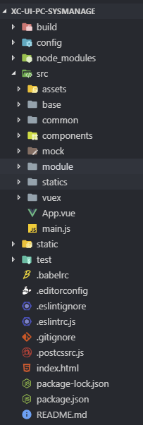
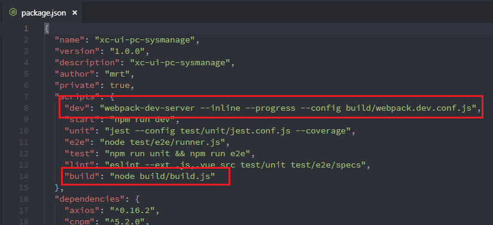
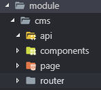
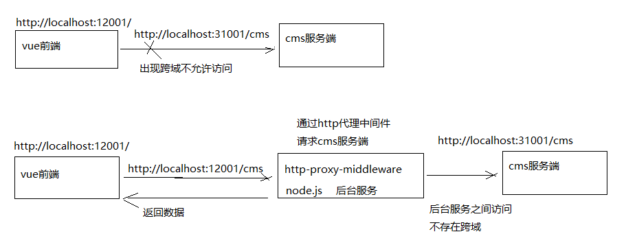

# Day02 CMS前端开发

## 1. Vue.js 与Webpack研究

- 参考资料：学成在线-Vue.js与Webpack.pdf
- Webpack知识参考自己整理的笔记：【03】前端资料/【05】node.js & webpack/02-webpack 笔记.md，（暂时不全）

## 2. CMS 前端工程创建
### 2.1. 导入系统管理前端工程

- CMS系统使用Vue-cli脚手架创建， Vue-cli是Vue官方提供的快速构建单页应用的脚手架，github地址：https://github.com/vuejs/vue-cli
- 本项目使用的前端框架是对Vue-cli创建的工程进行二次封装

#### 2.1.1. 工程结构

基于Vue-Cli创建的工程进行开发还需要在它基础上作一些封装，导入课程资料中提供Vue-Cli封装工程。将课程资料中的xc-ui-pc-sysmanage.7z拷贝到UI工程目录中，并解压，打开xc-ui-pc-sysmanage目录



#### 2.1.2. package.json

package.json记录了工程所有依赖，及脚本命令：



- 开发使用：`npm run dev`
- 打包使用：`npm run build`

#### 2.1.3. webpack.base.conf.js

- webpack.base.conf.js 就是 webpack 的 webpack.config.js 配置文件，在此文件中配置了入口文件及各种Loader。
- webpack 是通过 vue-load 解析`.vue`文件，通过 css-load 打包 css 文件等。

#### 2.1.4. main.js

- main.js 是工程的入口文件，在此文件中加载了很多第三方组件，如：Element-UI、Base64、VueRouter等。
- index.html 是模板文件。

#### 2.1.5. src目录

src目录下存放页面及js代码。目录结构如下

```sh
├── build                      # 构建相关
├── config                     # 项目配置-如请求后台代理等
├── node_modules               # 项目依赖包
├── src                        # 源代码
│   ├── assets                 # 存放一些静态文件，如图片。
│   ├── base                   # 存放基础组件
│       ├── api                # 基础api接口
│       ├── component          # 基础组件，被各各模块都使用的组件
│       └── router             # 总的路由配置，加载各模块的路由配置文件
│   ├── common                 # 工具类
│   ├── component              # 组件目录，本项目不用。
│   ├── mock                   # 存放前端单元测试方法
│   ├── module                 # 存放各业务模块的页面和api方法，下级目录以模块名命名，下边以cms举例
│       ├── cms/api            # cms模块的api接口
│       ├── cms/component      # cms模块的组件
│       ├── cms/page           # cms模块的页面
│       └── cms/router         # cms模块的路由配置
│   ├── statics                # 存放第三方组件的静态资源
│   ├── vuex                   # 存放vuex文件，本项目不使用
│   ├── App.vue                # 入口页面
│   └── main.js                # 入口文件 加载组件 初始化等
├── static                     # 与src的平级目录，此目录存放静态资源。它与assets的区别在于，static目录中的文件不被webpack打包处理，会原样拷贝到dist目录下
├── tests                      # 测试
├── .eslintrc.js               # eslint 配置项
├── index.html                 # 模版文件
├── package-lock.json          # package-lock.json
└── package.json               # package.json
```

### 2.2. 单页面应用介绍

单页Web应用（single page web application，SPA），就是只有一张Web页面的应用。单页应用程序 (SPA) 是加载单个HTML 页面并在用户与应用程序交互时动态更新该页面的Web应用程序。浏览器一开始会加载必需的HTML、CSS和JavaScript，所有的操作都在这张页面上完成，都由JavaScript来控制。因此，对单页应用来说模块化的开发和设计显得相当重要。

- 单页面应用的优点：
    1. 用户操作体验好，用户不用刷新页面，整个交互过程都是通过Ajax来操作。
    2. 适合前后端分离开发，服务端提供http接口，前端请求http接口获取数据，使用JS进行客户端渲染。
- 单页面应用的缺点：
    1. 首页加载慢。单页面应用会将js、 css打包成一个文件，在加载页面显示的时候加载打包文件，如果打包文件较大或者网速慢则用户体验不好。
    2. SEO不友好。SEO（Search Engine Optimization）为搜索引擎优化。它是一种利用搜索引擎的搜索规则来提高网站在搜索引擎排名的方法。目前各家搜索引擎对JS支持不好，所以使用单页面应用将大大减少搜索引擎对网站的收录。

总结：本项目的门户、课程介绍不采用单页面应用架构去开发，对于需要用户登录的管理系统采用单页面开发。

## 3. CMS 前端页面查询开发
### 3.1. 页面原型
#### 3.1.1. 页面结构

在module目录创建 cms模块的目录结构



- 在page目录新建page_list.vue，扩展名为.vue。
- 注意：template内容必须有一个根元素，否则vue会报错，这里我们在template标签内定义一个div。

#### 3.1.2. 页面路由

- 在cms目录下创建page_list.vue页面。
- 现在先配置路由，实现url访问到页面再进行内容完善与调试。

1. 在cms的router下配置路由，创建index.js文件，配置如下内容

```js
import Home from '@/module/home/page/home.vue';
import page_list from '@/module/cms/page/page_list.vue';
export default [{
  path: '/cms',
  component: Home,
  name: 'CMS内容管理',
  hidden: false,
  children: [{
    path: '/cms/page/list',
    name: '页面列表',
    component: page_list,
    hidden: false
  }]
}]
```

2. 在base目录下的router导入cms模块的路由

```js
// // 导入路由规则
import HomeRouter from '@/module/home/router'
import CmsRouter from '@/module/cms/router'
// 合并路由规则
concat(HomeRouter)
concat(CmsRouter)
```

3. 测试：启动工程http://localhost:11000，刷新页面，页面可以外正常浏览，并且看到“测试页面显示...”字样

注：如果使用教程提供的部署时报错，`Module build failed: Error: Node Sass does not yet support your current environment: Windows 64-bit with Unsupported runtime (64)`。是因为sass不支持当前的环境，那么在当前环境重新安装一下就好了。

```sh
npm uninstall --save node-sass # 先卸载
npm install node-sass # 在安装
```

#### 3.1.3. Element-UI介绍

- 本项目使用Element-UI来构建界面，Element是一套为开发者、设计师和产品经理准备的基于 Vue 2.0 的桌面端组件库。
- Element-UI官方站点：http://element.eleme.io/#/zh-CN/component/installation

#### 3.1.4. Table 组件测试

- 本功能实现的页面列表，用户可以进行分页查询、输入查询条件查询，通过查看Element-UI库，需要Table 表格、Form表单 及Pagination 分页组件。
- 进入Element-UI官方，找到Table组件，拷贝源代码到vue页面中，进行相应的修改

```vue
<template>
  <div class="page">
    <el-button type="primary" v-on:click="query" size="small">查询</el-button>
    <el-table :data="list" stripe style="width: 100%">
      <el-table-column type="index" width="60"></el-table-column>
      <el-table-column prop="pageName" label="页面名称"></el-table-column>
      <el-table-column prop="pageAliase" label="别名" width="120"></el-table-column>
      <el-table-column prop="pageType" label="页面类型" width="150"></el-table-column>
      <el-table-column prop="pageWebPath" label="访问路径"></el-table-column>
      <el-table-column prop="pagePhysicalPath" label="物理路径"></el-table-column>
      <el-table-column prop="pageCreateTime" label="创建时间" width="180"></el-table-column>
    </el-table>
    <el-pagination
      layout="prev, pager, next"
      :page-size="params.size"
      v-on:current-change="changePage"
      :total="total"
      :current-page="params.page"
      style="float:right;"
    ></el-pagination>
  </div>
</template>

<script>
export default {
  data() {
    return {
      list: [], // 表格数据
      total: 50,  // 总记录数
      params: {
        page: 1,  // 页码
        size: 2   // 每页显示个数
      }
    };
  },
  methods: {
    // 点击分页查询
    changePage() {
      this.query();
    },
    // 查询后台方法
    query() {
      alert("查询")
    }
  }
}
</script>

<style>
</style>
```

### 3.2. Api 调用
#### 3.2.1. Api方法定义

- 在cms模块的api目录定义cms.js，在cms.js中定义如下js方法，此方法实现http请求服务端页面查询接口。

```js
// public是对axios的工具类封装，定义了http请求方法
import http from './../../../base/api/public'

export const page_list = (page, size, params) => {
  return http.requestQuickGet('http://localhost:31001/cms/page/list/' + page + '/' + size)
}
```

axios实现了http方法的封装，因为vue.js官方不再继续维护vue-resource，所以推荐使用 axios。

#### 3.2.2. 页面 Api 调用

前端页面page_list.vue导入cms.js，调用js方法请求服务端页面查询接口。

1. 导入cms.js

```js
import * as cmsApi from '../api/cms'
```

2. 在query方法中调用 page_list 方法

```js
query: function () {
  cmsApi.page_list(this.params.page, this.params.size, this.params).then(response => {
    console.log("cmsList返回值===" + JSON.stringify(response))
    this.list = response.queryResult.list
    this.total = response.queryResult.total
  })
}
```

### 3.3. 跨域问题解决

- 测试上边的代理 ，结果报错如下：

```sh
Access to XMLHttpRequest at 'http://localhost:31001/cms/page/list/1/2' from origin 'http://localhost:11000' has been blocked by CORS policy: No 'Access-Control-Allow-Origin' header is present on the requested resource
```

- 原因：浏览器的同源策略不允许跨域访问，所谓同源策略是指协议、域名、端口相同。
- 解决：采用proxyTable解决。

#### 3.3.1. proxyTable 简介

vue-cli提供的解决vue开发环境下跨域问题的方法，proxyTable的底层使用了http-proxy-middleware（https://github.com/chimurai/http-proxy-middleware），它是 http代理中间件，它依赖node.js，基本原理是用服务端代理解决浏览器跨域：



#### 3.3.2. cms跨域解决原理

1. 访问页面http://localhost:11000/
2. 页面请求http://localhost:11000/cms。由于url由http://localhost:31001/cms...改为 “http://localhost:11000/cms."，所以不存在跨域
3. 通过proxyTable由node服务器代理请求 http://localhost:31001/cms。**服务端之间不存在跨域问题**

#### 3.3.3. 具体项目配置 proxyTable

1. 修改cms.js中，api方法中url的定义。在请求前加/api前缀

```js
// public是对axios的工具类封装，定义了http请求方法
import http from './../../../base/api/public'
// 导入配置文件
let sysConfig = require('@/../config/sysConfig')
// 获取学成api请求url前缀，sysConfig.xcApiUrlPre = '/api'
let apiUrl = sysConfig.xcApiUrlPre;

export const page_list = (page, size, params) => {
  // 拼接后的url为/api/cms/page/list/xx/xx，代理后为请求http://localhost:31001/cms/page/list/xx/xx
  return http.requestQuickGet(apiUrl + '/cms/page/list/' + page + '/' + size)
}
```

2. 在config/index.js下配置proxyTable。以/api/cms开头的请求，代理请求后会变成http://localhost:31001

```js
'/api/cms': {
    target: 'http://localhost:31001',
    pathRewrite: {
      '^/api': '' // 实际请求去掉/api
    }
}
```

### 3.4. 进入页面立即查询

目前实现的功能是进入页面点击查询按钮向服务端表求查询，实际的需求是进入页面立即查询。

这要用到vue的钩子函数，每个 Vue 实例在被创建时都要经过一系列的初始化过程——例如，需要设置数据监听、编译模板、将实例挂载到 DOM 并在数据变化时更新 DOM 等。同时在这个过程中也会运行一些叫做生命周期钩子的函数，这给了用户在不同阶段添加自己的代码的机会。

- 通常使用最多的是created和mounted两个钩子：
    - `created`：vue实例已创建但是DOM元素还没有渲染生成。
    - `mounted`：DOM元素渲染生成完成后调用。

本例子在两个方法的任意一个都满足需求：

```js
export default {
    mounted() {
        this.query()
    },
    ...
}
```

### 3.5. 分页查询测试

1. 使用v-on监听分页组件，点击当前页事件

```html
<el-pagination
  layout="prev, pager, next"
  :page-size="params.size"
  v-on:current-change="changePage"
  :total="total"
  :current-page="params.page"
  style="float:right;"
></el-pagination>
```

2. 定义数据模型对象

```
data() {
    return {
        list: [], // 表格数据
        total: 0,  // 总记录数
        params: {
            page: 1,  // 页码
            size: 10   // 每页显示个数
        }
    };
}
```

3. 定义分页方法，接收页码参数

```js
// 点击分页查询
changePage(page) {
    this.params.page = page
    this.query()
}
```

## 4. 前后端请求响应流程小结


1. 在浏览器输入前端url
2. 前端框架vue.js根据url解析路由，根据路由找到page_list.vue页面
3. 首先执行page_list.vue中的钩子方法
4. 在钩子方法中调用query方法。
5. 在query方法中调用cms.js中的page_list方法
6. cms.js中的page_list方法通过axios请求服务端接口
7. 采用proxyTable解决跨域问题，node.js将请求转发到服务端(http://localhost:31001/cms/page/list)
8. 服务端处理，将查询结果响应给前端
9. 成功响应调用then方法，在then方法中处理响应结果，将查询结果赋值给数据模型中的total和list变量。
10. vue.js通过双向数据绑定将list数据渲染输出。
