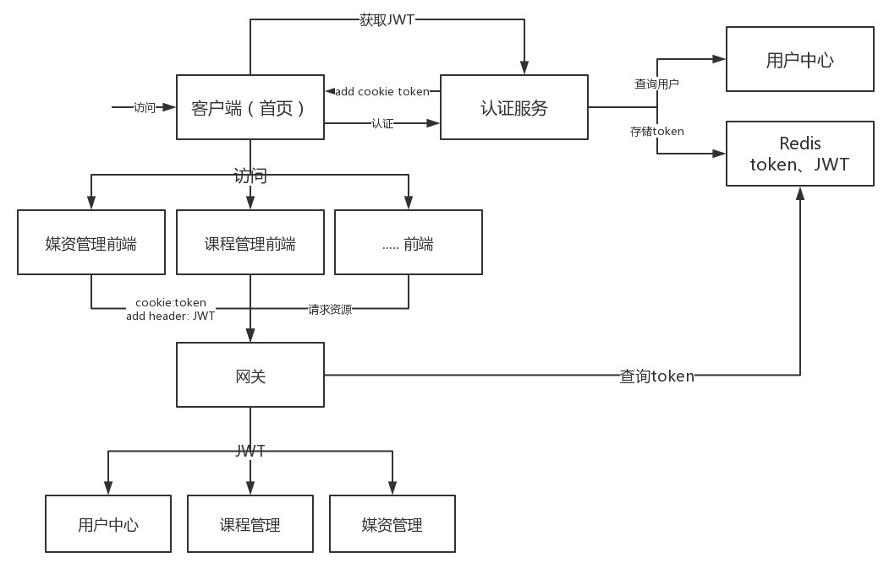
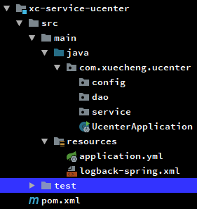
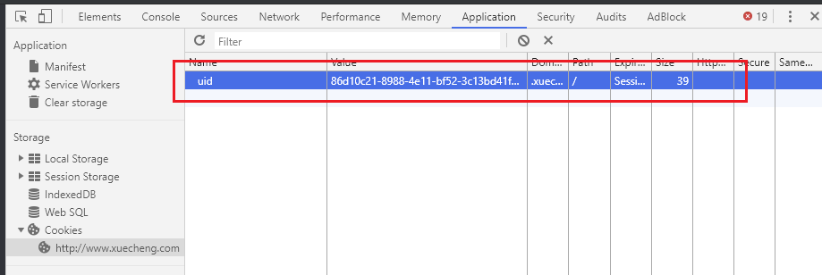
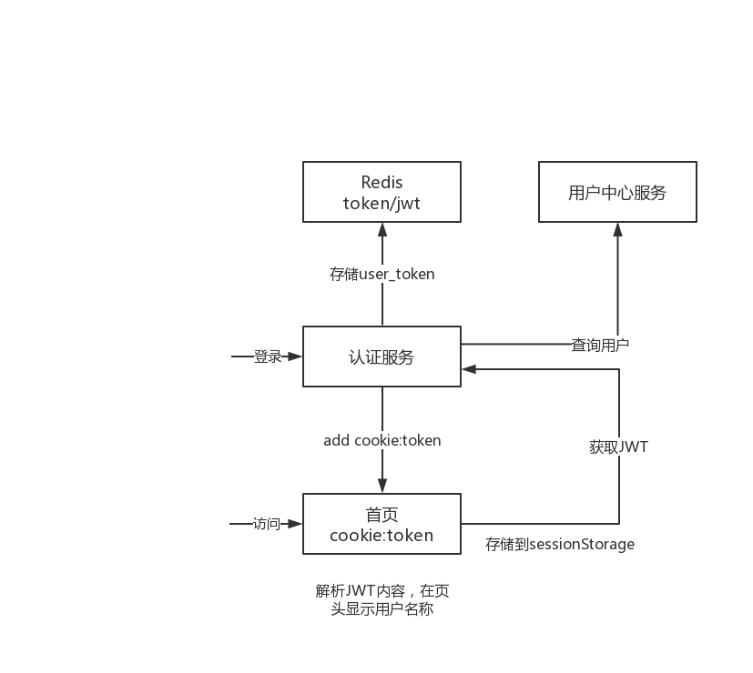
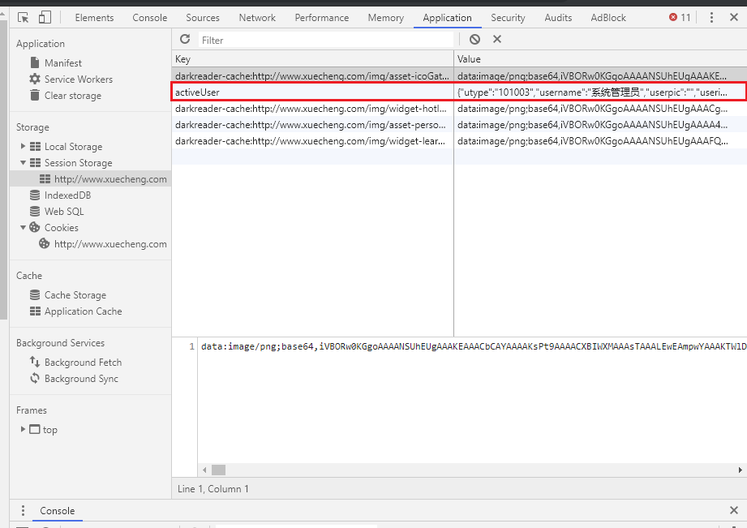
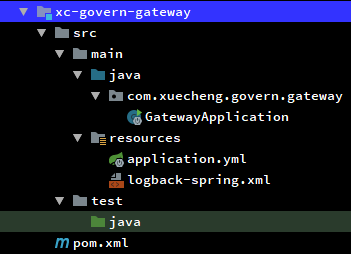
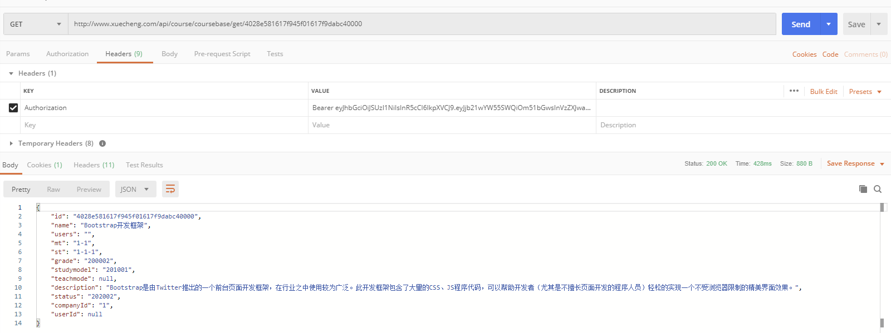

# Day17 用户认证 & Zuul 网关

## 1. 用户认证
### 1.1. 用户认证流程分析



- 业务流程说明
1. **客户端请求认证服务进行认证**。
2. **认证服务认证通过向浏览器cookie写入token(身份令牌)**
    - 认证服务请求用户中心查询用户信息。
    - 认证服务请求Spring Security申请令牌。
    - 认证服务将token(身份令牌)和jwt令牌存储至redis中。
    - 认证服务向cookie写入token(身份令牌)。
3. **前端携带token请求认证服务获取jwt令牌**
    - 前端获取到jwt令牌并存储在sessionStorage。
    - 前端从jwt令牌中解析中用户信息并显示在页面。
4. **前端携带cookie中的token身份令牌及jwt令牌访问资源服务**
    - 前端请求资源服务需要携带两个token，一个是cookie中的身份令牌，一个是http header中的jwt令牌
    - 前端请求资源服务前在http header上添加jwt请求资源
5. **网关校验token的合法性**
    - 用户请求必须携带token身份令牌和jwt令牌
    - 网关校验redis中token是否合法，已过期则要求用户重新登录
6. **资源服务校验jwt的合法性并完成授权**
    - 资源服务校验jwt令牌，完成授权，拥有权限的方法正常执行，没有权限的方法将拒绝访问

### 1.2. 认证服务查询数据库
#### 1.2.1. 需求分析

- 认证服务根据数据库中的用户信息去校验用户的身份，即校验账号和密码是否匹配
- 认证服务不直接连接数据库，而是通过用户中心服务去查询用户中心数据库


#### 1.2.2. 搭建环境
##### 1.2.2.1. 创建用户中心数据库

用户中心负责用户管理，包括：用户信息管理、角色管理、权限管理等

导入xc_user数据库数据，day16已经导入

##### 1.2.2.2. 创建用户中心工程

资料位置：\day17 用户认证 Zuul\资料\xc-service-ucenter.zip



#### 1.2.3. 查询用户接口开发

该接口主要是完成用户中心根据账号查询用户信息接口功能

##### 1.2.3.1. 后端 API 接口

1. 在xc-framework-model工程，创建用户扩展响应数据类型XcUserExt，因为此接口将来被用来查询用户信息及用户权限信息

```java
@Data
@ToString
public class XcUserExt extends XcUser {
    //权限信息
    private List<XcMenu> permissions;
    //企业信息
    private String companyId;
}

@Data
@ToString
@Entity
@Table(name = "xc_user")
@GenericGenerator(name = "jpa-uuid", strategy = "uuid")
public class XcUser {
    @Id
    @GeneratedValue(generator = "jpa-uuid")
    @Column(length = 32)
    private String id;
    private String username;
    private String password;
    private String salt;
    private String name;
    private String utype;
    private String birthday;
    private String userpic;
    private String sex;
    private String email;
    private String phone;
    private String status;
    @Column(name = "create_time")
    private Date createTime;
    @Column(name = "update_time")
    private Date updateTime;
}
```

2. 在xc-service-api工程，创建根据账号查询用户信息的接口方法

```java
package com.xuecheng.api.ucenter;

import com.xuecheng.framework.domain.ucenter.ext.XcUserExt;
import io.swagger.annotations.Api;
import io.swagger.annotations.ApiOperation;

/**
 * 用户中心服务接口
 */
@Api(value = "用户中心", description = "用户中心管理")
public interface UcenterControllerApi {
    @ApiOperation("根据用户账号查询用户信息")
    public XcUserExt getUserext(String username);
}
```

##### 1.2.3.2. dao 层

在xc-service-ucenter工程，添加XcUser、XcCompantUser两个表的Dao数据访问层接口（使用spring-data-jpa）

```java
package com.xuecheng.ucenter.dao;

import com.xuecheng.framework.domain.ucenter.XcUser;
import org.springframework.data.jpa.repository.JpaRepository;

/**
 * xc_user 表数据访问接口
 */
public interface XcUserRepository extends JpaRepository<XcUser, String> {
    /**
     * 根据账号查询用户信息
     *
     * @param username 用户账号
     * @return 用户对象
     */
    XcUser findByUsername(String username);
}

package com.xuecheng.ucenter.dao;

import com.xuecheng.framework.domain.ucenter.XcCompanyUser;
import org.springframework.data.jpa.repository.JpaRepository;

/**
 * xc_company_user 表数据访问接口
 */
public interface XcCompanyUserRepository extends JpaRepository<XcCompanyUser, String> {
    /**
     * 根据用户id查询该用户所属的公司id
     *
     * @param userId 用户ID
     * @return 用户所属公司对象
     */
    XcCompanyUser findByUserId(String userId);
}
```

##### 1.2.3.3. service 层

创建UserService业务类，实现用户查询的方法

```java
package com.xuecheng.ucenter.service;

import com.xuecheng.framework.domain.ucenter.XcCompanyUser;
import com.xuecheng.framework.domain.ucenter.XcUser;
import com.xuecheng.framework.domain.ucenter.ext.XcUserExt;
import com.xuecheng.ucenter.dao.XcCompanyUserRepository;
import com.xuecheng.ucenter.dao.XcUserRepository;
import org.springframework.beans.BeanUtils;
import org.springframework.beans.factory.annotation.Autowired;
import org.springframework.stereotype.Service;

/**
 * 用户中心业务逻辑层
 */
@Service
public class UserService {
    /* 注入用户数据访问接口 */
    @Autowired
    private XcUserRepository xcUserRepository;
    /* 注入用户公司数据访问接口 */
    @Autowired
    private XcCompanyUserRepository xcCompanyUserRepository;

    /**
     * 根据用户账号查询xcUser信息
     *
     * @param username 用户账号
     * @return 用户信息对象
     */
    public XcUser findXcUserByUsername(String username) {
        return xcUserRepository.findByUsername(username);
    }

    /**
     * 根据账号查询用户的信息，返回用户扩展信息
     *
     * @param username 用户账号
     * @return XcUserExt
     */
    public XcUserExt getUserExt(String username) {
        // 根据用户账号查询用户信息
        XcUser xcUser = findXcUserByUsername(username);
        if (xcUser == null) {
            return null;
        }

        // 复制用户信息到扩展对象中
        XcUserExt xcUserExt = new XcUserExt();
        BeanUtils.copyProperties(xcUser, xcUserExt);

        // 获取用户id
        String id = xcUser.getId();
        // 根据用户id查询用户所属公司id
        XcCompanyUser xcCompanyUser = xcCompanyUserRepository.findByUserId(id);

        // 获取用户公司id，将设置到扩展对象中
        if (xcCompanyUser != null) {
            xcUserExt.setCompanyId(xcCompanyUser.getCompanyId());
        }
        return xcUserExt;
    }
}
```

##### 1.2.3.4. Controller 层

创建UcenterController控制层，实现UcenterControllerApi接口

```java
package com.xuecheng.ucenter.controller;

import com.xuecheng.api.ucenter.UcenterControllerApi;
import com.xuecheng.framework.domain.ucenter.ext.XcUserExt;
import com.xuecheng.ucenter.service.UserService;
import org.springframework.beans.factory.annotation.Autowired;
import org.springframework.stereotype.Controller;
import org.springframework.web.bind.annotation.PostMapping;
import org.springframework.web.bind.annotation.RequestMapping;
import org.springframework.web.bind.annotation.RequestParam;

/**
 * 用户信息控制层
 */
@RestController
@RequestMapping("/ucenter")
public class UcenterController implements UcenterControllerApi {
    /* 注入用户信息业务逻辑层 */
    @Autowired
    private UserService userService;

    @Override
    @GetMapping("/getuserext")
    public XcUserExt getUserext(@RequestParam("username") String username) {
        return userService.getUserExt(username);
    }
}
```

##### 1.2.3.5. 测试

使用Swagger-ui或postman测试用户信息查询接口

#### 1.2.4. Feign调用查询用户接口
##### 1.2.4.1. 认证服务创建 Feign client 接口

认证服务需要远程调用用户中心服务查询用户，在认证服务中创建Feign客户端

```java
package com.xuecheng.auth.client;

import com.xuecheng.framework.client.XcServiceList;
import com.xuecheng.framework.domain.ucenter.ext.XcUserExt;
import org.springframework.cloud.openfeign.FeignClient;
import org.springframework.web.bind.annotation.GetMapping;
import org.springframework.web.bind.annotation.RequestParam;

/**
 * 用户中心服务远程调用接口
 */
@FeignClient(value = XcServiceList.XC_SERVICE_UCENTER)
public interface UserClient {
    @GetMapping("/ucenter/getuserext")
    public XcUserExt getUserext(@RequestParam("username") String username);
}
```

##### 1.2.4.2. 修改认证服务 UserDetailsServiceImpl

认证服务调用spring security接口申请令牌，spring security接口会调用UserDetailsServiceImpl从数据库查询用户，如果查询不到则返回 NULL，表示不存在；在UserDetailsServiceImpl中将正确的密码返回，spring security 会自动去比对输入密码的正确性

1. 修改 UserDetailsServiceImpl 的 loadUserByUsername 方法，调用 Ucenter 服务的查询用户接口

```java
package com.xuecheng.auth.service;

import com.xuecheng.auth.client.UserClient;
import com.xuecheng.framework.domain.ucenter.XcMenu;
import com.xuecheng.framework.domain.ucenter.ext.XcUserExt;
import org.apache.commons.lang3.StringUtils;
import org.springframework.beans.factory.annotation.Autowired;
import org.springframework.security.core.Authentication;
import org.springframework.security.core.authority.AuthorityUtils;
import org.springframework.security.core.context.SecurityContextHolder;
import org.springframework.security.core.userdetails.User;
import org.springframework.security.core.userdetails.UserDetails;
import org.springframework.security.core.userdetails.UserDetailsService;
import org.springframework.security.core.userdetails.UsernameNotFoundException;
import org.springframework.security.oauth2.provider.ClientDetails;
import org.springframework.security.oauth2.provider.ClientDetailsService;
import org.springframework.stereotype.Service;

import java.util.ArrayList;
import java.util.List;

@Service
public class UserDetailsServiceImpl implements UserDetailsService {

    /* 注入用户中心远程调用接口 */
    @Autowired
    private UserClient userClient;

    @Autowired
    ClientDetailsService clientDetailsService;

    @Override
    public UserDetails loadUserByUsername(String username) throws UsernameNotFoundException {
        // 取出身份，如果身份为空说明没有认证
        Authentication authentication = SecurityContextHolder.getContext().getAuthentication();
        // 没有认证统一采用httpbasic认证，httpbasic中存储了client_id和client_secret，开始认证client_id和client_secret
        if (authentication == null) {
            ClientDetails clientDetails = clientDetailsService.loadClientByClientId(username);
            if (clientDetails != null) {
                // 密码
                String clientSecret = clientDetails.getClientSecret();
                return new User(username, clientSecret, AuthorityUtils.commaSeparatedStringToAuthorityList(""));
            }
        }
        if (StringUtils.isEmpty(username)) {
            return null;
        }

        /* 远程调用用户中心根据账号查询用户信息 */
        XcUserExt userext = userClient.getUserext(username);
        if (userext == null) {
            // 返回空，给表示用户不存在，Spring Security会抛出异常
            return null;
        }

        /* 权限暂时用静态的 */
        userext.setPermissions(new ArrayList<XcMenu>());

        // 取出正确密码（hash值）
        String password = userext.getPassword();

        // 用户权限，这里暂时使用静态数据，最终会从数据库读取
        // 从数据库获取权限
        List<XcMenu> permissions = userext.getPermissions();
        List<String> user_permission = new ArrayList<>();
        permissions.forEach(item -> user_permission.add(item.getCode()));
        // user_permission.add("course_get_baseinfo");
        // user_permission.add("course_find_pic");
        String user_permission_string = StringUtils.join(user_permission.toArray(), ",");
        UserJwt userDetails = new UserJwt(username,
                password,
                AuthorityUtils.commaSeparatedStringToAuthorityList(user_permission_string));
        userDetails.setId(userext.getId());
        userDetails.setUtype(userext.getUtype());//用户类型
        userDetails.setCompanyId(userext.getCompanyId());//所属企业
        userDetails.setName(userext.getName());//用户名称
        userDetails.setUserpic(userext.getUserpic());//用户头像
        /*UserDetails userDetails = new org.springframework.security.core.userdetails.User(username,
                password,
                AuthorityUtils.commaSeparatedStringToAuthorityList(""));*/
        // AuthorityUtils.createAuthorityList("course_get_baseinfo","course_get_list"));
        return userDetails;
    }
}
```

2. 测试，请求http://localhost:40400/auth/userlogin，观察UserDetailsServiceImpl是否正常请求Ucenter的查询用户接口


##### 1.2.4.3. BCryptPasswordEncoder

- 早期使用md5对密码进行编码，每次算出的md5值都一样，这样非常不安全，Spring Security推荐使用 BCryptPasswordEncoder 对密码加随机盐，每次的Hash值都不一样，安全性高

```java
@Test
public void testPasswrodEncoder() {
    // 原始密码
    String password = "123456";
    BCryptPasswordEncoder bCryptPasswordEncoder = new BCryptPasswordEncoder();
    // 使用BCrypt加密，每次加密使用一个随机盐
    for (int i = 0; i < 10; i++) {
        // 每个计算出的Hash值都不一样
        String encode = bCryptPasswordEncoder.encode(password);
        System.out.println("第" + (i + 1) + "次加密结果：" + encode);
        // 虽然每次计算的密码Hash值不一样但是校验是通过的
        boolean matches = bCryptPasswordEncoder.matches(password, encode);
        System.out.println("第" + (i + 1) + "次校验：" + matches);
    }
}
```

测试结果

```console
第1次加密结果：$2a$10$qiCvnloZdWHEKJ6SksfsfuK/R59..k5bs126qScOW228GS9jqbaLO
第1次校验：true
第2次加密结果：$2a$10$wAi2tVm9QnLUOT95IxKynu6DBDOxrX8.iaLqgXQfMKacGVaZqPMCm
第2次校验：true
第3次加密结果：$2a$10$4FE6HN/.N9EF45snJ5LOZu4VJ3dEis9M0PmBsy/qhQHyPa3aqJI.u
第3次校验：true
第4次加密结果：$2a$10$5h/Yp/RXSBYxOv6GI9ifAO6O5qpphsYSWH70j4qg4z03vRwutiUhK
第4次校验：true
第5次加密结果：$2a$10$/.UnZ6SewioaaDn/qd71zua5SWK7q86hV7vKCwXX/oxqL/xksLzkK
第5次校验：true
第6次加密结果：$2a$10$ZyBx1b04f/7Pja8kQoGEiOrECmRVC/n9IolmmN8/xG38DVCdmRfwC
第6次校验：true
第7次加密结果：$2a$10$rTQ2Czq6LgPG7J4uEKM0PufCdDvGzIRe1dAHQZVuYpaI3nqqHM2h.
第7次校验：true
第8次加密结果：$2a$10$56LFTYUNRq/BtwOTSRrWj.6VdQlcr/SsnS8rhkNCofplxDsUsIxNC
第8次校验：true
第9次加密结果：$2a$10$OkHVb5YQUsbQHNtRDuagEuEnXA/2BtjGjK76G7Cfiz4vdXzuJHrdq
第9次校验：true
第10次加密结果：$2a$10$1Dhe3zuYmWAcxf33sNjCDO2pL92hwEGa1DN0J/oa8mkexBWxbO1ly
第10次校验：true
```

- 在AuthorizationServerConfig配置类中配置BCryptPasswordEncoder

```java
// 授权服务器的安全配置
@Override
public void configure(AuthorizationServerSecurityConfigurer oauthServer) throws Exception {
    oauthServer.allowFormAuthenticationForClients()
            .passwordEncoder(new BCryptPasswordEncoder())
            .tokenKeyAccess("permitAll()")
            .checkTokenAccess("isAuthenticated()");
}
```

- 测试。请求http://localhost:40400/auth/userlogin，输入正常的账号和密码进行测试


##### 1.2.4.4. 解析申请令牌错误信息

当账号输入错误应该返回用户不存在的信息，当密码错误要返回用户名或密码错误信息，业务流程图如下


修改认证业务类AuthService中的applyToken申请令牌方法，解析返回的错误。由于restTemplate收到400或401的错误会抛出异常，而spring security针对账号不存在及密码错误会返回400及401，所以在代码中控制针对400或401的响应不要抛出异常。

```java
@Service
public class AuthService {
    ......
    private AuthToken applyToken(String username, String password, String clientId, String clientSecret) {
        ......
        // 判断返回的令牌信息
        if (tokenMap == null
                || tokenMap.get("access_token") == null
                || tokenMap.get("refresh_token") == null
                || tokenMap.get("jti") == null) {   // jti是jwt令牌的唯一标识作为用户身份令牌
            // 解析spring security返回的错误信息
            if (tokenMap != null && tokenMap.get("error_description") != null) {
                String error_description = (String) tokenMap.get("error_description");
                if (error_description.indexOf("UserDetailsService returned null") >= 0) {
                    ExceptionCast.cast(AuthCode.AUTH_ACCOUNT_NOTEXISTS);
                } else if (error_description.indexOf("坏的凭证") >= 0) {
                    ExceptionCast.cast(AuthCode.AUTH_CREDENTIAL_ERROR);
                }
            }
            // 其中一个信息为空，则是授权失败，返回Null
            return null;
        }
        ......
    }
}
```

用户不存在:


密码错误：


##### 1.2.4.5. 测试

- 使用postman请求http://localhost:40400/auth/userlogin
1. 输入正确的账号和密码进行测试。从数据库找到测试账号，用户信息表中初始密码统一为111111
2. 输入错误的账号和密码进行测试

### 1.3. 用户登录前端
#### 1.3.1. 需求分析

- 点击用户登录固定跳转到用户中心前端的登录页面


- 输入账号和密码，登录成功，跳转到首页
- 用户中心前端（xc-ui-pc-learning工程）提供登录页面，所有子系统连接到此页面
- 说明：
    - 页面有“登录|注册”链接的前端系统有：门户系统、搜索系统、用户中心。
    - 本次修改门户系统的页头，其它三处可参考门户修改

#### 1.3.2. 前端Api方法

进入xc-ui-pc-learning工程定义api方法，在base模块下定义login.js，创建登陆方法

```js
import http from './public'
import qs from 'qs'

/* 登陆 */
export const login = params => {
  let loginRequest = qs.stringify(params);
  return http.requestPostForm('/openapi/auth/userlogin', loginRequest);
}
```

#### 1.3.3. 登陆页面

1. 登录页面在xc-ui-pc-leanring\src\module\home\pageloginpage.vue。loginpage.vue使用了loginForm.vue组件，loginForm.vue页面包括了登录表单
2. 路由配置，在home模块（\src\module\home\router\index.js）配置路由

```js
import Home from '@/module/home/page/home.vue';
import Login from '@/module/home/page/loginpage.vue';
import Denied from '@/module/home/page/denied.vue';
import Logout from '@/module/home/page/logout.vue';
import order_pay from '@/module/order/page/order_pay.vue';
export default [{
    path: '/',
    component: Home,
    name: '个人中心',
    hidden: true
  },
  {
    path: '/login',
    component: Login,
    name: 'Login',
    hidden: true
  },
  ....
```

3. 登录后跳转
    - 请求登录页面需携带returnUrl参数，要求此参数使用Base64编码
    - 登录成功后将跳转到returnUrl，修改loginForm.vue组件中的登录方法

```js
login: function () {
  this.$refs.loginForm.validate(valid => {
    if (valid) {
      this.editLoading = true;
      let para = Object.assign({}, this.loginForm);

      loginApi.login(para).then(res => {
        this.editLoading = false;
        if (res.success) {
          this.$message('登陆成功');
          // 刷新 当前页面
          console.log(this.returnUrl)
          if (this.returnUrl != 'undefined' && this.returnUrl != ''
            && !this.returnUrl.includes("/userlogout")
            && !this.returnUrl.includes("/userlogin")) {

            window.location.href = this.returnUrl;
          } else {
            //跳转到首页
            window.location.href = 'http://www.xuecheng.com/'
          }
        } else {
          if (res.message) {
            this.$message.error(res.message);
          } else {
            this.$message.error('登陆失败');
          }
        }
      }, res => {
        this.editLoading = false;
      });
    }
  });
},
```

#### 1.3.4. 点击登录页面

在门户的页头点击“登录|注册”连接到用户中心的登录页面，并且携带returnUrl。修改门户前端（xc-ui-pc-static-portal）的header.html

```html
<a href="javascript:;" @click="showlogin" v-if="logined == false">登陆&nbsp;|&nbsp;注册</a>

showlogin: function(){
    window.location = "http://ucenter.xuecheng.com/#/login?returnUrl="+ Base64.encode(window.location)
}
```

#### 1.3.5. 测试

测试之前修改认证服务的配置，修改 application.yml 中cookie域名（已经修改可以不用理会）

```yml
cookieDomain: xuecheng.com
```

测试流程如下：

1. 输入www.xuecheng.com进入系统（需要在 hosts文件配置）
2. 输入正确的账号和密码，提交
3. 输入错误的账号和密码，提交

登录成功，观察cookie是否存储成功



## 2. 前端显示当前用户
### 2.1. 需求分析

用户登录成功在页头显示当前登录的用户名称。数据流程如下图：



1. 用户请求认证服务，登录成功
2. 用户登录成功，认证服务向cookie写入身份令牌，向redis写入user_token（身份令牌及授权jwt授权令牌）
3. 客户端携带cookie中的身份令牌请求认证服务获取jwt令牌
4. 客户端解析jwt令牌，并将解析的用户信息存储到sessionStorage中
    - jwt令牌中包括了用户的基本信息，客户端解析jwt令牌即可获取用户信息
5. 客户端从sessionStorage中读取用户信息，并在页头显示
    - sessionStorage 是H5的一个会话存储对象，在SessionStorage中保存的数据只在同一窗口或同一标签页中有效，在关闭窗口之后将会删除SessionStorage中的数据
    - seesionStorage 的存储方式采用key/value的方式，可保存5M左右的数据（不同的浏览器会有区别）

### 2.2. JWT查询接口
#### 2.2.1. 需求分析

认证服务对外提供jwt查询接口，流程如下

1. 客户端携带cookie中的身份令牌请求认证服务获取jwt
2. 认证服务根据身份令牌从redis中查询jwt令牌并返回给客户端

#### 2.2.2. 后端API接口

在认证模块AuthControllerApi中定义JWT查询接口方法

```java
@Api(value = "用户认证", description = "用户认证接口")
public interface AuthControllerApi {
    ......
    @ApiOperation("查询用户jwt令牌")
    public JwtResult userjwt();
}
```

#### 2.2.3. Service 层

在AuthService业务层定义从redis获取令牌的方法

```java
/**
 * 从reids根据用户身份令牌查询jwt令牌
 *
 * @param token 用户身份令牌
 * @return JWT令牌
 */
public AuthToken getUserToken(String token) {
    // 拼接redis令牌对应的key
    String key = new StringBuilder("user_token:").append(token).toString();

    // 根据key从redis中取到令牌信息
    String userTokenString_1 = stringRedisTemplate.boundValueOps(key).get();  // 获取值方式1
    String userTokenString = stringRedisTemplate.opsForValue().get(key);  // 获取值方式2
    System.out.println("两种方式获取的值比较为：" + userTokenString.equals(userTokenString_1));

    // 转成AuthToken对象
    if (StringUtils.isNoneBlank(userTokenString)) {
        try {
            AuthToken authToken = JSON.parseObject(userTokenString, AuthToken.class);
            return authToken;
        } catch (Exception e) {
            e.printStackTrace();
            LOGGER.error("getUserToken from redis and execute JSON.parseObject error: {}", e.getMessage());
        }
    }
    return null;
}
```


#### 2.2.4. Controller 层

在AuthController实现查询用户jwt令牌接口方法

```java
/**
 * 查询用户jwt令牌
 *
 * @return JwtResult
 */
@Override
@GetMapping("/userjwt")
public JwtResult userjwt() {
    // 取出cookie中的用户身份令牌
    String token = getTokenFormCookie();
    if (StringUtils.isBlank(token)) {
        // cookie中无身份令牌，返回失败结果
        return new JwtResult(CommonCode.FAIL, null);
    }

    // 根据身份令牌从redis查询jwt
    AuthToken authToken = authService.getUserToken(token);
    if (authToken == null) {
        // 查询无JWT令牌，返回失败结果
        return new JwtResult(CommonCode.FAIL, null);
    }
    return new JwtResult(CommonCode.SUCCESS, authToken.getJwt_token());
}

/**
 * 取出cookie中的身份令牌
 *
 * @return 身份令牌字符串
 */
private String getTokenFormCookie() {
    // 获取HttpServletRequest
    HttpServletRequest request = ((ServletRequestAttributes) RequestContextHolder.getRequestAttributes()).getRequest();
    // 调用方法获取所有cookies值
    Map<String, String> cookieMap = CookieUtil.readCookie(request, "uid");
    return cookieMap.get("uid");
}
```

#### 2.2.5. 测试

1. 使用postman测试，GET请求http://ucenter.xuecheng.com/openapi/auth/userlogin，观察cookie是否已存入用户身份令牌


2. GET请求http://ucenter.xuecheng.com/openapi/auth/userjwt，返回JWT令牌


### 2.3. 前端请求获取JWT
#### 2.3.1. 需求分析

1. 用户登录成功，前端请求认证服务获取jwt令牌
2. 前端解析jwt令牌的内容，得到用户信息，并将用户信息存储到 sessionStorage
3. 从 sessionStorage 取出用户信息在页头显示用户名称

#### 2.3.2. 前端API方法

在xc-ui-pc-static-portal前端工程中的login.js中定义getjwt方法

```js
/* 获取jwt令牌 */
const getjwt = () => {
    return requestGet('/openapi/auth/userjwt');
}
```

#### 2.3.3. 前端页面

1. 修改include/header.html文件，用户登录成功设置数据对象logined为true，设置数据对象user为当前用户信息

```html
<span v-if="logined">欢迎{{this.user.username}}</span>
<a href="javascript:;" @click="logout" v-if="logined">退出</a>
<a href="http://ucenter.xuecheng.com/" class="personal" target="_blank">我的学习</a>
<a href="javascript:;" @click="showlogin" v-if="!logined">登陆&nbsp;|&nbsp;注册</a>
<a href="http://teacher.xuecheng.com/" class="personal" target="_blank">教学提供方</a>
<a href="http://system.xuecheng.com/" class="personal" target="_blank">系统后台</a>
```

相关的数据对象

```js
user:{
    userid:'',
    username: '',
    userpic: ''
},
logined:false
```

2. 解析JWT令牌，在util.js中定义解析jwt令牌方法

```js
// 解析jwt令牌，获取用户信息
var getUserInfoFromJwt = function (jwt) {
    if(!jwt){
        return ;
    }
    var jwtDecodeVal = jwt_decode(jwt);
    if (!jwtDecodeVal) {
        return ;
    }
    let activeUser={}
    //console.log(jwtDecodeVal)
    activeUser.utype = jwtDecodeVal.utype || '';
    activeUser.username = jwtDecodeVal.name || '';
    activeUser.userpic = jwtDecodeVal.userpic || '';
    activeUser.userid = jwtDecodeVal.userid || '';
    activeUser.authorities = jwtDecodeVal.authorities || '';
    activeUser.uid = jwtDecodeVal.jti || '';
    activeUser.jwt = jwt;
    return activeUser;
}
```

3. 在mounted钩子方法中获取当前用户信息，并将用户信息存储到sessionStorage

```js
mounted(){
    // 刷新当前用户
    this.refresh_user()
},
refresh_user:function(){
    // 从sessionStorage中取出当前用户
    let activeUser = getActiveUser();
    // 取出cookie中的令牌
    let uid = getCookie("uid")
    // console.log(activeUser)
    if(activeUser && uid && uid == activeUser.uid){
        this.logined = true
        this.user = activeUser;
    }else{
        if(!uid){
            return;
        }
        //请求查询jwt
        getjwt().then((res) => {
            if(res.success){
                let jwt = res.jwt;
                let activeUser = getUserInfoFromJwt(jwt)
                if(activeUser){
                    this.logined = true
                    this.user = activeUser;
                    setUserSession("activeUser", JSON.stringify(activeUser))
                }
            }
        })
    }
},
```

#### 2.3.4. 配置代理转发

上边实现在首页显示当前用户信息，首页需要通过Nginx代理请求认证服务，所以需要在首页的虚拟主机上配置代理路径

```conf
# 认证授权
location ^~ /openapi/auth/ {
	proxy_pass http://auth_server_pool/auth/;
}
```

> **注意：其它前端系统要接入认证要请求认证服务也需要配置上边的代理路径**



## 3. 用户退出
### 3.1. 需求分析

1. 用户退出需要删除redis中的token
2. 删除cookie中的token

### 3.2. 服务羰
#### 3.2.1. 后端API接口

在xc-service-api工程认证服务AuthControllerApi类定义对外提供退出接口

```java
@ApiOperation("退出")
public ResponseResult logout();
```

#### 3.2.2. Service 层

在xc-service-ucenter-auth工程的业务层AuthService类定义删除redis中JWT令牌方法

```java
/**
 * 删除Redis中的token令牌
 *
 * @param access_token 用户的身份令牌
 * @return 是否成功
 */
public boolean delToken(String access_token) {
    // 拼接redis中对应的key
    String key = "user_token:" + access_token;
    // 删除redis中数据
    stringRedisTemplate.delete(key);
    return true;
}
```

#### 3.2.3. Controller 层

修改AuthController中的退出方法

```java
/**
 * 用户退出
 *
 * @return 响应结果
 */
@Override
@PostMapping("/userlogout")
public ResponseResult logout() {
    // 取出cookie中的用户身份令牌
    String token = getTokenFormCookie();
    // 调用业务层删除redis中JWT令牌的方法
    authService.delToken(token);
    // 清除cookie
    this.clearCookie(token);
    return ResponseResult.SUCCESS();
}

/**
 * 根据删除身份令牌删除cookie
 *
 * @param token 用户身份令牌
 */
private void clearCookie(String token) {
    // 获取HttpServletResponse对象
    HttpServletResponse response = ((ServletRequestAttributes) RequestContextHolder.getRequestAttributes()).getResponse();
    // 将cookie的过期时间设置为0（即删除cookie）
    CookieUtil.addCookie(response, this.cookieDomain, "/", "uid", token, 0, false);
}
```

#### 3.2.4. 退出URL放行

- 认证服务默认都要校验用户的身份信息，所以xc-service-ucenter-auth工程需要将退出url放行
- 在 WebSecurityConfig 类中重写 `configure(WebSecurity web)` 方法

```java
@Override
public void configure(WebSecurity web) throws Exception {
    web.ignoring().antMatchers("/userlogin", "/userlogout");
}
```

### 3.3. 前端页面
#### 3.3.1. 需求分析

在用户中心前端工程（xc-ui-pc-learning）开发退出页面

#### 3.3.2. 前端API方法

在用户中心工程增加退出的api方法，修改base模块的login.js，增加方法

```js
/* 退出 */
export const logout = params => {
  return http.requestPost('/openapi/auth/userlogout');
}
```

#### 3.3.3. 退出页面

1. 在用户中心工程创建退出页面loginpage.vue
2. 配置路由(\src\module\home\router\index.js)

```js
export default [{
    path: '/',
    component: Home,
    name: '个人中心',
    hidden: true
  },
  {
    path: '/login',
    component: Login,
    name: 'Login',
    hidden: true
  },
  {
    path: '/logout',
    component: Logout,
    name: 'Logout',
    hidden: true
  },
  ......
]
```

3. 在退出页面的created钩子方法请求退出方法，退出成功清除页面的sessionStorage

```js
created() {
  loginApi.logout({}).then(res => {
    if (res.success) {
      // 清除页面的sessionStorage
      sessionStorage.removeItem('activeUser');
      this.$message('退出成功');
      this.logoutsuccess = true
    } else {
      this.logoutsuccess = false
    }
  }, res => {
    this.logoutsuccess = false
  });
},
```

#### 3.3.4. 其他前端工程连接到退出页面

1. 以门面工程为例，修改include/header.html

```html
<a href="javascript:;" @click="logout" v-if="logined">退出</a>
```

2. 在include/header.html中`<header>`标签内（*注：将此js加到head的最下边*）添加element-ui库

```html
<script src="/css/el/index.js"></script>
```

3. 定义logout方法

```js
logout: function () {
    this.$confirm('确认退出吗?', '提示', {
    }).then(() => {
        //跳转到统一登陆
        window.location = "http://ucenter.xuecheng.com/#/logout"
    }).catch(() => {

    });
},
```

#### 3.3.5. 测试

用户登陆后，再点点击退出


## 4. Zuul 网关
### 4.1. 需求分析

- 网关的作用相当于一个过虑器、拦截器，它可以拦截多个系统的请求
- 本项目主要使用网关校验用户的身份是否合法

### 4.2. Zuul 介绍

- 什么是Zuul？
    - Spring Cloud Zuul是整合Netflix公司的Zuul开源项目实现的微服务网关，它实现了请求路由、负载均衡、校验过虑等功能
    - 官网：https://github.com/Netflix/zuul
- 什么是网关？
    - 服务网关是在微服务前边设置一道屏障，请求先到服务网关，网关会对请求进行过虑、校验、路由等处理。有了服务网关可以提高微服务的安全性，网关校验请求的合法性，请求不合法将被拦截，拒绝访问
- Zuul与Nginx怎么配合使用？
    - Zuul与Nginx在实际项目中需要配合使用，如下图，Nginx的作用是反向代理、负载均衡，Zuul的作用是保障微服务的安全访问，拦截微服务请求，校验合法性及负载均衡


### 4.3. 搭建网关工程

1. 创建xc-govern-gateway网关工程，使用资料【\day17 用户认证 Zuul\资料\xc-govern-gateway.zip】



2. 在pom.xml文件中引入相关依赖，在启动类上使用`@EnableZuulProxy`注解标识此工程为Zuul网关

```java
package com.xuecheng.govern.gateway;

import org.springframework.boot.SpringApplication;
import org.springframework.boot.autoconfigure.SpringBootApplication;
import org.springframework.cloud.netflix.zuul.EnableZuulProxy;

/**
 * zuul网关工程
 */
@SpringBootApplication
@EnableZuulProxy    // 标识此工程是一个zuul网关
public class GatewayApplication {
    public static void main(String[] args) {
        SpringApplication.run(GatewayApplication.class, args);
    }
}
```

### 4.4. 路由配置
#### 4.4.1. 需求分析

Zuul网关具有代理的功能，根据请求的url转发到微服务


> 客户端请求网关/api/learning，通过路由转发到/learning
>
> 客户端请求网关/api/course，通过路由转发到/course

#### 4.4.2. 网关配置路由

在xc-govern-gateway工程appcation.yml中配置

```yml
# 网关zuul配置
zuul:
  routes:
    manage-course:  # 路由名称，名称任意，保持所有路由名称唯一
      path: /course/**
      serverId: xc-service-manage-course  # 微服务名称，网关会从eureka中获取该服务名称下的服务实例的地址
      # 例子：将请求转发到http://localhost:31200/course
      # url: http://www.baidu.com # 也可指定url，此url也可以是外网地址
      strip-prefix: false # true：代理转发时去掉前缀，false:代理转发时不去掉前缀
      sensitiveHeaders: # 默认zuul会屏蔽cookie，cookie不会传到下游服务，这里设置为空则取消默认的黑名单，如果设置了具体的头信息则不会传到下游服务
      # ignoredHeaders: 默认为空表示不过虑任何头
```

相关配置参数解释

- `serviceId`：微服务在注册中心注册的服务名称，推荐使用serviceId，zuul会从Eureka中找到服务id对应的ip和端口
- `strip-prefix`：代理转发时是否去掉前缀。（true则代理转发时去掉前缀，false则代理转发时不去掉前缀）。例如配置为true时，请求/course/coursebase/get/..，代理转发到/coursebase/get/，如果配置为false则代理转发到/course/coursebase/get
- `sensitiveHeaders`：敏感头设置，默认会过滤掉cookie，这里设置为空表示不过滤
- `ignoredHeaders`：可以设置过滤的头信息，默认为空表示不过滤任何头

#### 4.4.3. 测试网关

- 启动eureka服务后，将xc-govern-gateway和xc-service-manage-course启动
- 请求http://localhost:50201/api/course/coursepic/list/4028e58161bd22e60161bd23672a0001查询课程图片信息
    - http://localhost:50201/api是网关地址，通过路由转发到 xc-service-manage-course服务

> 注：由于课程管理已经添加了授课拦截，这里为了测试网关功能暂时将“/course/coursepic/list”url排除认证
>
> 在课程管理服务的ResourceServerConfig类中添加`"/course/coursepic/list/*"`

```java
// Http安全配置，对每个到达系统的http请求链接进行校验
@Override
public void configure(HttpSecurity http) throws Exception {
    // 所有请求必须认证通过
    http.authorizeRequests()
            // 配置下边的路径放行
            .antMatchers("/v2/api-docs", "/swagger-resources/configuration/ui",
                    "/swagger-resources", "/swagger-resources/configuration/security",
                    "/swagger-ui.html", "/webjars/**", "/course/coursepic/list/**").permitAll()
            .anyRequest().authenticated();
}
```

#### 4.4.4. 完整的路由配置

```yml# 网关zuul配置
zuul:
  routes:
    manage-course: # 路由名称，名称任意，保持所有路由名称唯一
      path: /course/**
      serviceId: xc-service-manage-course  # 微服务名称，网关会从eureka中获取该服务名称下的服务实例的地址
      # 例子：将请求转发到http://localhost:31200/course
      # url: http://www.baidu.com # 也可指定url，此url也可以是外网地址
      strip-prefix: false # true：代理转发时去掉前缀，false:代理转发时不去掉前缀
      sensitiveHeaders: # 默认zuul会屏蔽cookie，cookie不会传到下游服务，这里设置为空则取消默认的黑名单，如果设置了具体的头信息则不会传到下游服务
      # ignoredHeaders: 默认为空表示不过虑任何头
    xc-service-learning:  # 路由名称，名称任意，保持所有路由名称唯一
      path: /learning/**
      serviceId: xc-service-learning # 指定服务id，从Eureka中找到服务的ip和端口
      strip-prefix: false
      sensitiveHeaders:
    manage-cms:
      path: /cms/**
      serviceId: xc-service-manage-cms
      strip-prefix: false
      sensitiveHeaders:
    manage-sys:
      path: /sys/**
      serviceId: xc-service-manage-cms
      strip-prefix: false
      sensitiveHeaders:
    service-ucenter:
      path: /ucenter/**
      serviceId: xc-service-ucenter
      sensitiveHeaders:
      strip-prefix: false
    xc-service-manage-order:
      path: /order/**
      serviceId: xc-service-manage-order
      sensitiveHeaders:
      strip-prefix: false
```

### 4.5. 过滤器

Zuul的核心就是过滤器，通过过虑器实现请求过虑，身份校验等

#### 4.5.1. ZuulFilter

自定义过滤器需要继承ZuulFilter，ZuulFilter是一个抽象类，需要覆盖它的四个方法

1. `shouldFilter`：返回一个Boolean值，判断该过滤器是否需要执行。返回true表示要执行此过滤器，否则不执行
2. `run`：过滤器的业务逻辑。
3. `filterType`：返回字符串代表过滤器的类型，如下 pre：请求在被路由之前执行 routing：在路由请求时调用 post：在routing和errror过滤器之后调用 error：处理请求时发生错误调用
4. `filterOrder`：此方法返回整型数值，通过此数值来定义过滤器的执行顺序，数字越小优先级越高

#### 4.5.2. 自定义过滤器测试

需求：过滤所有请求，判断头部信息是否有Authorization，如果没有则拒绝访问，有则转发到微服务。

定义过滤器，使用`@Component`标识该bean给spring容器管理

```java
package com.xuecheng.govern.gateway.filter;

import com.alibaba.fastjson.JSON;
import com.netflix.zuul.ZuulFilter;
import com.netflix.zuul.context.RequestContext;
import com.netflix.zuul.exception.ZuulException;
import com.xuecheng.framework.model.response.CommonCode;
import com.xuecheng.framework.model.response.ResponseResult;
import org.springframework.stereotype.Component;
import org.springframework.util.StringUtils;

import javax.servlet.http.HttpServletRequest;
import javax.servlet.http.HttpServletResponse;

/**
 * 自定义过滤器测试
 */
@Component
public class LoginFilterTest extends ZuulFilter {

    /**
     * 设置过滤器类型
     * pre：请求在被路由之前执行
     * routing：在路由请求时调用
     * post：在routing和errror过滤器之后调用
     * error：处理请求时发生错误调用
     *
     * @return 过滤器的类型字符串
     */
    @Override
    public String filterType() {
        // 设置在路由转发请求之前执行
        return "pre";
    }

    /**
     * 过滤器序号，越小越被优先执行
     *
     * @return
     */
    @Override
    public int filterOrder() {
        return 0;
    }

    /**
     * 过滤器是否需要执行。
     *
     * @return true: 执行此过滤器，false: 不执行
     */
    @Override
    public boolean shouldFilter() {
        return true;
    }

    /**
     * 过滤器的业务逻辑方法
     *
     * @return
     * @throws ZuulException
     */
    @Override
    public Object run() throws ZuulException {
        // 获取HttpServletRequest和HttpServletResponse对象
        RequestContext requestContext = RequestContext.getCurrentContext();
        HttpServletRequest request = requestContext.getRequest();
        HttpServletResponse response = requestContext.getResponse();

        // 获取请求头中Authorization字段
        String authorization = request.getHeader("Authorization");
        if (StringUtils.isEmpty(authorization)) {
            // 如果请求头不包含Authorization，则拒绝访问
            requestContext.setSendZuulResponse(false);
            // 设置响应状态码
            requestContext.setResponseStatusCode(200);
            // 设置JSON格式的响应信息
            ResponseResult responseResult = new ResponseResult(CommonCode.UNAUTHENTICATED);
            requestContext.setResponseBody(JSON.toJSONString(responseResult));
            // 设置contentType为json类型
            response.setContentType("application/json;charset=UTF-8");
        }
        return null;
    }
}
```

测试请求：http://localhost:50201/api/course/coursebase/get/4028e581617f945f01617f9dabc40000查询课程信息

1. Header中不设置Authorization，响应结果

```json
{
    "code": 10001,
    "message": "此操作需要登陆系统！",
    "success": false
}
```

2. Header中设置Authorization，成功获取课程数据

## 5. 身份校验
### 5.1. 需求分析

- 实现网关连接Redis校验令牌
1. 从cookie查询用户身份令牌是否存在，不存在则拒绝访问
2. 从http header查询jwt令牌是否存在，不存在则拒绝访问
3. 从Redis查询user_token令牌是否过期，过期则拒绝访问

### 5.2. 配置redis参数

配置xc-govern-gateway工程的application.yml文件，设置redis相关参数

```yml
spring:
  application:
    name: xc-govern-gateway
  redis:
    host: ${REDIS_HOST:127.0.0.1}
    port: ${REDIS_PORT:6379}
    timeout: 5000 # 连接超时 毫秒
    jedis:
      pool:
        maxActive: 3
        maxIdle: 3
        minIdle: 1
        maxWait: -1 # 连接池最大等行时间 -1没有限制
```

### 5.3. 定义校验业务类

在service包下定义AuthService类，定义相关查询令牌的方法。

```java
package com.xuecheng.govern.gateway.service;

import com.xuecheng.framework.utils.CookieUtil;
import org.springframework.beans.factory.annotation.Autowired;
import org.springframework.data.redis.core.StringRedisTemplate;
import org.springframework.stereotype.Service;
import org.springframework.util.StringUtils;

import javax.servlet.http.HttpServletRequest;
import java.util.Map;
import java.util.concurrent.TimeUnit;

/**
 * 校验业务逻辑层
 */
@Service
public class AuthService {

    /* 注入redis操作对象 */
    @Autowired
    private StringRedisTemplate stringRedisTemplate;

    /**
     * 从cookie中获取用户身份令牌
     *
     * @param request 请求对象
     * @return 身份令牌字符串
     */
    public String getTokenFromCookie(HttpServletRequest request) {
        // 从cookie中获取身份令牌字符串
        Map<String, String> cookieMap = CookieUtil.readCookie(request, "uid");
        String access_token = cookieMap.get("uid");
        if (StringUtils.isEmpty(access_token)) {
            return null;
        }
        return access_token;
    }

    /**
     * 从header中查询jwt令牌
     *
     * @param request
     * @return JWT令牌字符串
     */
    public String getJwtFromHeader(HttpServletRequest request) {
        // 从请求头中获取JWT令牌
        String authorization = request.getHeader("Authorization");

        // 判断是否为空
        if (StringUtils.isEmpty(authorization)) {
            return null;
        }

        // 判断令牌格式是否正确
        if (!authorization.startsWith("Bearer ")) {
            return null;
        }
        /* 出现魔鬼数字。。。。为了截取"Bearer "以后的字符串 */
        return authorization.substring(7);
    }

    /**
     * 根据用户身份令牌查询redis中令牌的有效期
     *
     * @param access_token 用户身份令牌
     * @return 过期时间
     */
    public long getExpire(String access_token) {
        // 拼接key
        String key = "user_token:" + access_token;
        Long expire_1 = stringRedisTemplate.boundValueOps(key).getExpire();
        Long expire = stringRedisTemplate.getExpire(key, TimeUnit.SECONDS);
        System.out.println("比较两种获取时间的方式：" + (Long.compare(expire, expire_1) == 0));
        return expire;
    }
}
```

> **说明：由于令牌存储时采用 String 序列化策略，所以这里用 StringRedisTemplate 来查询key的有效期，使用 RedisTemplate 无法完成查询**

### 5.4. 定义身份校验过滤器

创建LoginFilter，实现身份校验逻辑

```java
package com.xuecheng.govern.gateway.filter;

import com.alibaba.fastjson.JSON;
import com.netflix.zuul.ZuulFilter;
import com.netflix.zuul.context.RequestContext;
import com.netflix.zuul.exception.ZuulException;
import com.xuecheng.framework.model.response.CommonCode;
import com.xuecheng.framework.model.response.ResponseResult;
import com.xuecheng.govern.gateway.service.AuthService;
import org.springframework.beans.factory.annotation.Autowired;
import org.springframework.stereotype.Component;
import org.springframework.util.StringUtils;

import javax.servlet.http.HttpServletRequest;
import javax.servlet.http.HttpServletResponse;

/**
 * zuul身份校验过滤器
 */
@Component
public class LoginFilter extends ZuulFilter {

    /* 注入校验业务逻辑层 */
    @Autowired
    private AuthService authService;

    /**
     * 设置过滤器类型
     * pre：请求在被路由之前执行
     * routing：在路由请求时调用
     * post：在routing和errror过滤器之后调用
     * error：处理请求时发生错误调用
     *
     * @return 过滤器的类型字符串
     */
    @Override
    public String filterType() {
        // 设置在路由转发请求之前执行
        return "pre";
    }

    /**
     * 过滤器序号，越小越被优先执行
     *
     * @return
     */
    @Override
    public int filterOrder() {
        return 0;
    }

    /**
     * 过滤器是否需要执行。
     *
     * @return true: 执行此过滤器，false: 不执行
     */
    @Override
    public boolean shouldFilter() {
        return true;
    }

    /**
     * 过滤器的业务逻辑方法
     *
     * @return
     * @throws ZuulException
     */
    @Override
    public Object run() throws ZuulException {
        // 获取HttpServletRequest对象
        RequestContext requestContext = RequestContext.getCurrentContext();
        HttpServletRequest request = requestContext.getRequest();

        // 从cookie中获取身份令牌
        String access_token = authService.getTokenFromCookie(request);
        if (StringUtils.isEmpty(access_token)) {
            // cookie中无用户身份令牌，拒绝访问
            this.access_denied(requestContext);
            return null;
        }

        // 从请求header中取JWT令牌
        String jwt = authService.getJwtFromHeader(request);
        if (StringUtils.isEmpty(jwt)) {
            // 请求头中无上送JWT令牌，拒绝访问
            this.access_denied(requestContext);
            return null;
        }

        // 从redis查询JWT的过期时间
        long expire = authService.getExpire(access_token);
        if (expire < 0) {
            // 令牌过期，拒绝访问
            this.access_denied(requestContext);
            return null;
        }
        // 通过校验
        return null;
    }

    /**
     * 拒绝访问
     *
     * @param requestContext 上下文对象
     */
    private void access_denied(RequestContext requestContext) {
        // 获取HttpServletResponse对象
        HttpServletResponse response = requestContext.getResponse();
        // 设置zuul网关响应，则拒绝访问
        requestContext.setSendZuulResponse(false);
        // 设置响应状态码
        requestContext.setResponseStatusCode(200);
        // 设置JSON格式的响应信息
        ResponseResult responseResult = new ResponseResult(CommonCode.UNAUTHENTICATED);
        requestContext.setResponseBody(JSON.toJSONString(responseResult));
        // 设置contentType为json类型
        response.setContentType("application/json;charset=UTF-8");
    }

}
```

> *注：将之前测试的自定义过滤器的`@Component`注解注释了，不然后会影响身份校验过滤器执行*

### 5.5. 测试

1. 配置代理。通过nginx转发到gateway，在www.xuecheng.com虚拟主机来配置

```conf
server {
    listen       80;
    server_name  www.xuecheng.com;
	......
	# 微服务网关	
	location /api {
		proxy_pass http://api_server_pool;
	}
}

# 微服务网关
upstream api_server_pool {
	server 127.0.0.1:50201 weight=10;
}
```

2. 使用postman测试。Get请求：http://www.xuecheng.com/api/course/coursebase/get/4028e581617f945f01617f9dabc40000

> 注意：这里通过网关请求了 course/coursebase/get地址，课程管理url根据自己的开发情况去配置

3. 测试正常的流程。
    1. Post请求：http://ucenter.xuecheng.com/openapi/auth/userlogin，执行登录使之向cookie写入身份令牌uid

    

    2. 手动在postman添加header
    3. 再次发送get请求，查询课程数据

    

4. 异常流程测试，手动删除header或清除cookie观察测试结果
