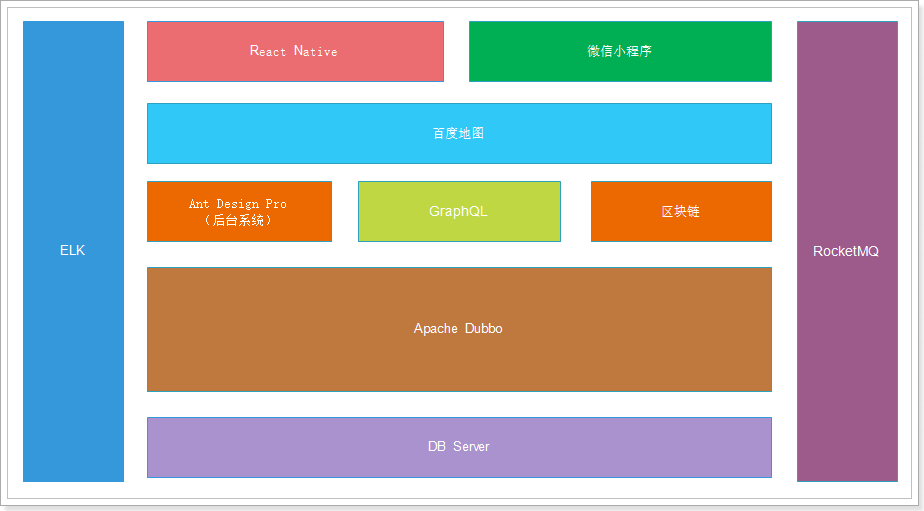
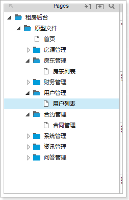
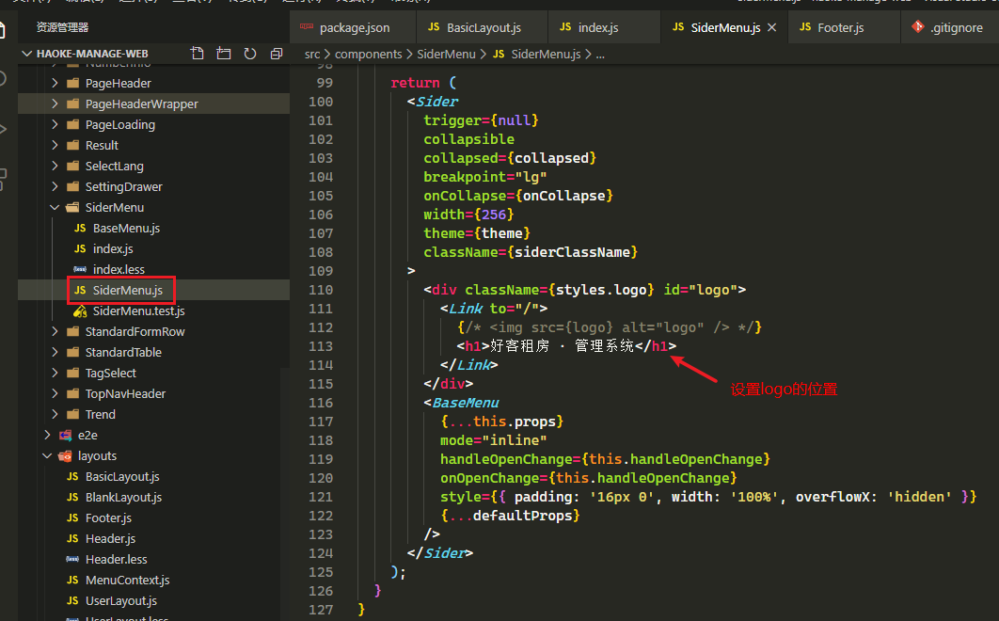
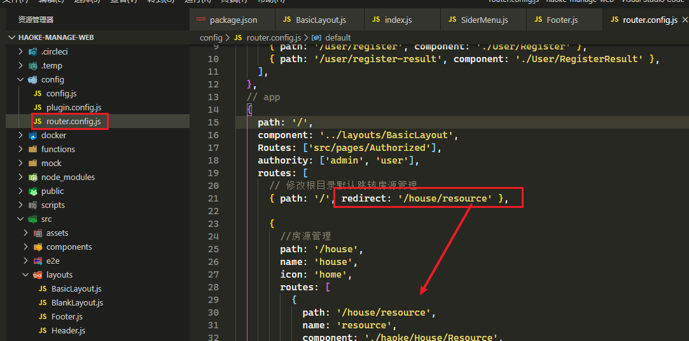

# Day03-项目介绍以及开发后台系统

## 1. 好客租房
### 1.1. 项目背景

详情查看项目资料

### 1.2. 项目介绍

详情查看项目资料

### 1.3. 技术架构

- 后端架构：SpringBoot + StringMVC + Dubbo + Mybatis + ELK + 区块链
- 前端架构：React.js + html5 + 百度地图 + 微信小程序

### 1.4. 系统架构图



## 2. 后台系统搭建

后台系统采用的是前后端分离开发模式，前端使用Ant Design Pro系统作为模板进行改造，后端采用的是SpringBoot+StringMVC+Dubbo+Mybatis的架构进行开发。

### 2.1. 前端搭建

根据前面的pro的入门知识，参考《好客租房 PRD 文档 V1.0.0beat.docx》、《好客租房后台V1.0.0.rp》，将系统的菜单、页面等做改造。



#### 2.1.1. 创建工程

- 第一步，将资料文件中的itcast-haoke-manage-web.zip解压项目开发的目录
- 第二步，导入到开发IDE中，本项目使用vsCode开发
- 第三步，到前端项目的目录下，执行命令导入相关的依赖

```bash
npm install # 安装依赖
npm start # 启动项目

# 如果安装了tyarn，也可以使用以下命令
#tyarn install #安装相关依赖
#tyarn start #启动服务
```


> ps: 如果提交到git的时候报错如下
>
> `husky > pre-commit hook failed (add --no-verify to bypass)`
>
> 这个问题是因为当你在终端输入git commit -m "XXX",提交代码的时候,pre-commit(客户端)钩子，它会在Git键入提交信息前运行做代码风格检查。如果代码不符合相应规则，则报错，而它的检测规则就是根据.git/hooks/pre-commit文件里面的相关定义。
>
> 解决方案有三种(推荐使用第3种方式，不需要删除package.json的依赖)：
>
> 1. 卸载husky。只要把项目的package.json文件中devDependencies节点下的husky库删掉，然后重新npm i 一次即可。或者直接在项目根目录下执行`npm uninstall husky --save`也可以，再次提交，自动化测试功能就屏蔽掉
> 2. 进入项目的.git文件夹(文件夹默认隐藏，可先设置显示或者命令ls查找)，再进入hooks文件夹，删除pre-commit文件，重新`git commit -m 'xxx' git push`即可。
> 3. 将`git commit -m "XXX"` 改为 `git commit --no-verify -m "XXX"`
>
> 使用git图形化操作客户端sourcetree，点选
>
> 

#### 2.1.2. 示例操作 - 修改logo以及版权信息

- 全局的布局文件


- 查看代码，左侧的菜单是自定义组件：

```jsx
// 这里是导入侧边栏组件
import SiderMenu from '@/components/SiderMenu';

{/* 项目的侧边栏是一个自定义组件 */}
{isTop && !isMobile ? null : (
  <SiderMenu
    logo={logo}
    Authorized={Authorized}
    theme={navTheme}
    onCollapse={this.handleMenuCollapse}
    menuData={menuData}
    isMobile={isMobile}
    {...this.props}
  />
)}
```

- 查看/components/SiderMenu文件，找到logo的位置



- 使用同样的方式找到定义底部信息的位置，在Footer.js文件中修改版权信息

```jsx
import React, { Fragment } from 'react';
import { Layout, Icon } from 'antd';
import GlobalFooter from '@/components/GlobalFooter';

const { Footer } = Layout;
const FooterView = () => (
  <Footer style={{ padding: 0 }}>
    <GlobalFooter
      copyright={
        <Fragment>
          Copyright <Icon type="copyright" /> 2020 MooNkirA 实践项目
        </Fragment>
      }
    />
  </Footer>
);
export default FooterView;
```

#### 2.1.3. 编写左侧菜单

- 根据需求文档，修改左侧的菜单。（参考项目代码：\haoke-project-ui\haoke-manage-web\config\router.config.js）
- 在src/pages目录下创建haoke文件夹，项目中的页面代码均放在此目录中


- 修改，进入系统后，默认打开房源管理页面



### 2.2. 新增房源
#### 2.2.1. 数据结构

参考资料中的《前后端开发接口文档.md》文档


