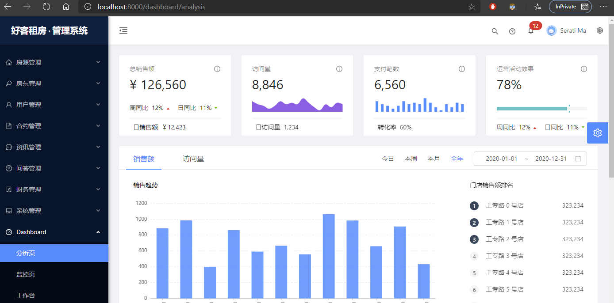
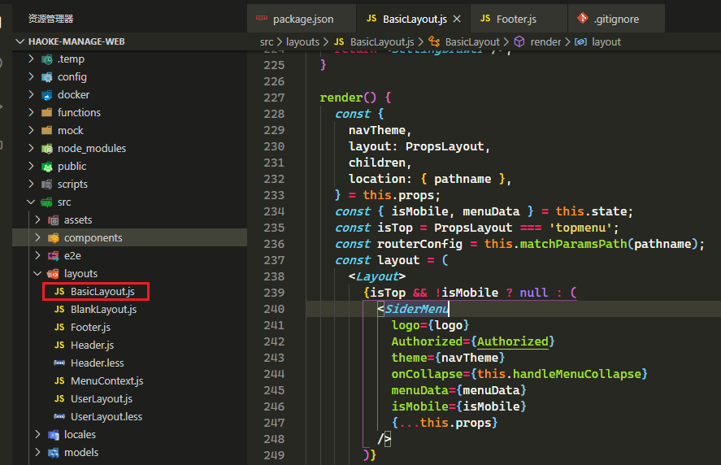
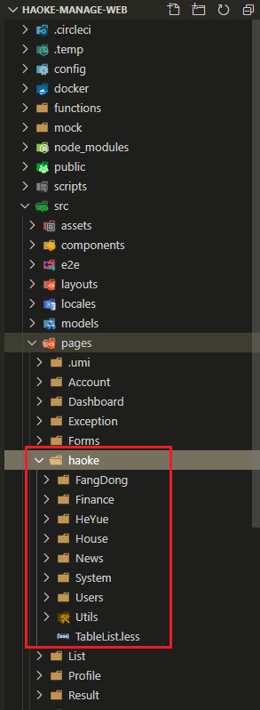
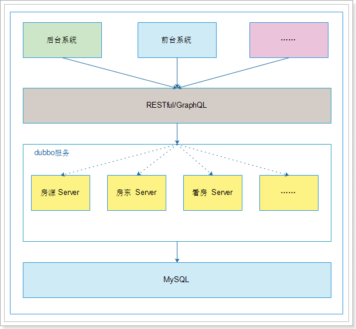
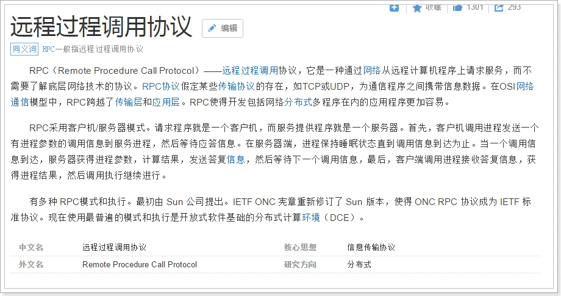
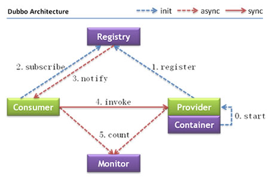

# Day03-项目介绍以及开发后台系统

## 1. 好客租房
### 1.1. 项目背景

详情查看项目资料

### 1.2. 项目介绍

详情查看项目资料

### 1.3. 技术架构

- 后端架构：SpringBoot + StringMVC + Dubbo + Mybatis + ELK + 区块链
- 前端架构：React.js + html5 + 百度地图 + 微信小程序

### 1.4. 系统架构图


## 2. 后台系统搭建

后台系统采用的是前后端分离开发模式，前端使用Ant Design Pro系统作为模板进行改造，后端采用的是SpringBoot+StringMVC+Dubbo+Mybatis的架构进行开发。

### 2.1. 前端搭建

根据前面的pro的入门知识，参考《好客租房 PRD 文档 V1.0.0beat.docx》、《好客租房后台V1.0.0.rp》，将系统的菜单、页面等做改造。


#### 2.1.1. 创建工程

- 第一步，将资料文件中的itcast-haoke-manage-web.zip解压项目开发的目录
- 第二步，导入到开发IDE中，本项目使用vsCode开发
- 第三步，到前端项目的目录下，执行命令导入相关的依赖

```bash
npm install # 安装依赖
npm start # 启动项目

# 如果安装了tyarn，也可以使用以下命令
#tyarn install #安装相关依赖
#tyarn start #启动服务
```



> ps: 如果提交到git的时候报错如下
>
> `husky > pre-commit hook failed (add --no-verify to bypass)`
>
> 这个问题是因为当你在终端输入git commit -m "XXX",提交代码的时候,pre-commit(客户端)钩子，它会在Git键入提交信息前运行做代码风格检查。如果代码不符合相应规则，则报错，而它的检测规则就是根据.git/hooks/pre-commit文件里面的相关定义。
>
> 解决方案有三种(推荐使用第3种方式，不需要删除package.json的依赖)：
>
> 1. 卸载husky。只要把项目的package.json文件中devDependencies节点下的husky库删掉，然后重新npm i 一次即可。或者直接在项目根目录下执行`npm uninstall husky --save`也可以，再次提交，自动化测试功能就屏蔽掉
> 2. 进入项目的.git文件夹(文件夹默认隐藏，可先设置显示或者命令ls查找)，再进入hooks文件夹，删除pre-commit文件，重新`git commit -m 'xxx' git push`即可。
> 3. 将`git commit -m "XXX"` 改为 `git commit --no-verify -m "XXX"`
>
> 使用git图形化操作客户端sourcetree，点选
>
> 

#### 2.1.2. 示例操作 - 修改logo以及版权信息

- 全局的布局文件



- 查看代码，左侧的菜单是自定义组件：

```jsx
// 这里是导入侧边栏组件
import SiderMenu from '@/components/SiderMenu';

{/* 项目的侧边栏是一个自定义组件 */}
{isTop && !isMobile ? null : (
  <SiderMenu
    logo={logo}
    Authorized={Authorized}
    theme={navTheme}
    onCollapse={this.handleMenuCollapse}
    menuData={menuData}
    isMobile={isMobile}
    {...this.props}
  />
)}
```

- 查看/components/SiderMenu文件，找到logo的位置


- 使用同样的方式找到定义底部信息的位置，在Footer.js文件中修改版权信息

```jsx
import React, { Fragment } from 'react';
import { Layout, Icon } from 'antd';
import GlobalFooter from '@/components/GlobalFooter';

const { Footer } = Layout;
const FooterView = () => (
  <Footer style={{ padding: 0 }}>
    <GlobalFooter
      copyright={
        <Fragment>
          Copyright <Icon type="copyright" /> 2020 MooNkirA 实践项目
        </Fragment>
      }
    />
  </Footer>
);
export default FooterView;
```

#### 2.1.3. 编写左侧菜单

- 根据需求文档，修改左侧的菜单。（参考项目代码：\haoke-project-ui\haoke-manage-web\config\router.config.js）
- 在src/pages目录下创建haoke文件夹，项目中的页面代码均放在此目录中



- 修改，进入系统后，默认打开房源管理页面


### 2.2. 新增房源
#### 2.2.1. 数据结构

参考资料中的《前后端开发接口文档.md》文档

#### 2.2.2. 编写页面

根据需求文档以及数据结构，找到对应的页面（src\pages\haoke\House\AddResource.js）进行编码，此部分主要认识一下表单组件的多种示例使用

##### 2.2.2.1. form组件

开发时可以参考form组件官方文档：https://ant.design/components/form-cn/

- 在页面中，通过`Form.create()`对页面进行了包装，包装之后，会在this.props中增加form对象，该对象将包含有很多API方法（*详见官方文档*）
- 在from表单中，需要通过getFieldDecorator（表单数据双向绑定）方法进行包装注册，才能获取到其值。（*用法参考官方文档*）

> 被设置了 `name` 属性的 `Form.Item` 包装的控件，表单控件会自动添加 `value`（或 `valuePropName` 指定的其他属性） `onChange`（或 `trigger` 指定的其他属性），数据同步将被 `Form` 接管，这会导致以下结果：
>
> 1. 你不再需要也不应该用 `onChange` 来做数据收集同步（你可以使用 Form 的 `onValuesChange`），但还是可以继续监听 `onChange` 事件。
> 2. 你不能用控件的 `value` 或 `defaultValue` 等属性来设置表单域的值，默认值可以用 Form 里的 `initialValues` 来设置。注意 `initialValues` 不能被 `setState` 动态更新，你需要用 `setFieldsValue` 来更新。
> 3. 你不应该用 `setState`，可以使用 `form.setFieldsValue` 来动态改变表单值。

- from表单输入项校验：在getFieldDecorator的参数中可以增加校验规则

##### 2.2.2.2. 表单提交

- 表单的提交通过submit按钮完成，通过onSubmit方法进行拦截处理
- 通过`form.validateFieldsAndScroll()`对表单进行校验，通过`values`获取表单中输入的值。通过`dispatch()`调用model中定义的方法

##### 2.2.2.3. 自动完成

- 功能实现参考官方文档：https://ant.design/components/auto-complete-cn/

##### 2.2.2.4. 图片上传

- 图片上传通过自定义组件PicturesWall完成，在PicturesWall中，通过Upload组件实现。
- 在代码实现中，需要解决的问题是：父组件如何获取子组件中的数据。
- 解决思路：父组件通过属性的方式进行引用子组件，在bind方法中改变this的引用为父组件，在子组件中，通过this.props获取传入的函数，进行调用，即可把数据传递到父组件中。

父组件：


子组件


父组件中的方法，获取数据

```js
handleFileList = obj => {
    console.log(obj, '图片列表');
};
```

## 3. 后台系统服务

前端系统已经搭建完成，需要后台系统为其提供接口服务。如：新增房源、房源列表、房东列表等。

### 3.1. 架构



说明：在后台服务的架构中，采用了RPC+微服务的架构思想，RPC采用dubbo框架作为服务治理框架，对外接口采用RESTful和GraphQL接口方式。

### 3.2. dubbo快速入门
#### 3.2.1. 什么是dubbo?

- Apache Dubbo™ (incubating)是一款高性能Java RPC框架。官网：http://dubbo.apache.org/zh-cn/index.html
- dubbo是由阿里团队开发的一款优秀的RPC框架，目前由Apache管理的框架

早期的相关介绍

> DUBBO是一个分布式服务框架，致力于提供高性能和透明化的RPC远程服务调用方案，是阿里巴巴SOA服务化治理方案的核心框架，每天为2,000+个服务提供3,000,000,000+次访问量支持，并被广泛应用于阿里巴巴集团的各成员站点。
>
> Dubbo是Alibaba开源的分布式服务框架，它最大的特点是按照分层的方式来架构，使用这种方式可以使各个层之间解耦合（或者最大限度地松耦合）。从服务模型的角度来看，Dubbo采用的是一种非常简单的模型，要么是提供方提供服务，要么是消费方消费服务，所以基于这一点可以抽象出服务提供方（Provider）和服务消费方（Consumer）两个角色。关于注册中心、协议支持、服务监控等内容。
>
> 什么是RPC？
>
> 

#### 3.2.2. 框架说明
##### 3.2.2.1. 背景

随着互联网的发展，网站应用的规模不断扩大，常规的垂直应用架构已无法应对，分布式服务架构以及流动计算架构势在必行，亟需一个治理系统确保架构有条不紊的演进。


- 单一应用架构

当网站流量很小时，只需一个应用，将所有功能都部署在一起，以减少部署节点和成本。此时，用于简化增删改查工作量的数据访问框架(ORM)是关键。

- 垂直应用架构

当访问量逐渐增大，单一应用增加机器带来的加速度越来越小，将应用拆成互不相干的几个应用，以提升效率。此时，用于加速前端页面开发的Web框架(MVC)是关键。

- 分布式服务架构

当垂直应用越来越多，应用之间交互不可避免，将核心业务抽取出来，作为独立的服务，逐渐形成稳定的服务中心，使前端应用能更快速的响应多变的市场需求。此时，用于提高业务复用及整合的分布式服务框架(RPC)是关键。

- 流动计算架构

当服务越来越多，容量的评估，小服务资源的浪费等问题逐渐显现，此时需增加一个调度中心基于访问压力实时管理集群容量，提高集群利用率。此时，用于提高机器利用率的资源调度和治理中心(SOA)是关键。

##### 3.2.2.2. 需求


在大规模服务化之前，应用可能只是通过 RMI 或 Hessian 等工具，简单的暴露和引用远程服务，通过配置服务的URL地址进行调用，通过 F5 等硬件进行负载均衡。

**当服务越来越多时，服务 URL 配置管理变得非常困难，F5 硬件负载均衡器的单点压力也越来越大**。 此时需要一个服务注册中心，动态的注册和发现服务，使服务的位置透明。并通过在消费方获取服务提供方地址列表，实现软负载均衡和 Failover，降低对 F5 硬件负载均衡器的依赖，也能减少部分成本。

**当进一步发展，服务间依赖关系变得错踪复杂，甚至分不清哪个应用要在哪个应用之前启动，架构师都不能完整的描述应用的架构关系**。这时，需要自动画出应用间的依赖关系图，以帮助架构师理清理关系。

**接着，服务的调用量越来越大，服务的容量问题就暴露出来，这个服务需要多少机器支撑？什么时候该加机器？**为了解决这些问题，第一步，要将服务现在每天的调用量，响应时间，都统计出来，作为容量规划的参考指标。其次，要可以动态调整权重，在线上，将某台机器的权重一直加大，并在加大的过程中记录响应时间的变化，直到响应时间到达阈值，记录此时的访问量，再以此访问量乘以机器数反推总容量。

以上是 Dubbo 最基本的几个需求

##### 3.2.2.3. 架构



**节点角色说明**

| 节点      | 角色说明                               |
| --------- | -------------------------------------- |
| Provider  | 暴露服务的服务提供方                   |
| Consumer  | 调用远程服务的服务消费方               |
| Registry  | 服务注册与发现的注册中心               |
| Monitor   | 统计服务的调用次数和调用时间的监控中心 |
| Container | 服务运行容器                           |

**调用关系说明**

1. 服务容器负责启动，加载，运行服务提供者。
2. 服务提供者在启动时，向注册中心注册自己提供的服务。
3. 服务消费者在启动时，向注册中心订阅自己所需的服务。
4. 注册中心返回服务提供者地址列表给消费者，如果有变更，注册中心将基于长连接推送变更数据给消费者。
5. 服务消费者，从提供者地址列表中，基于软负载均衡算法，选一台提供者进行调用，如果调用失败，再选另一台调用。
6. 服务消费者和提供者，在内存中累计调用次数和调用时间，定时每分钟发送一次统计数据到监控中心

Dubbo 架构具有以下几个特点，分别是连通性、健壮性、伸缩性、以及向未来架构的升级性。更多介绍参见：http://dubbo.apache.org/zh-cn/docs/user/preface/architecture.html


