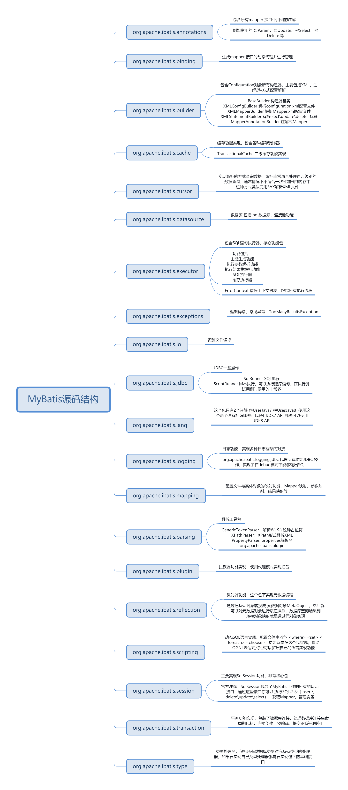
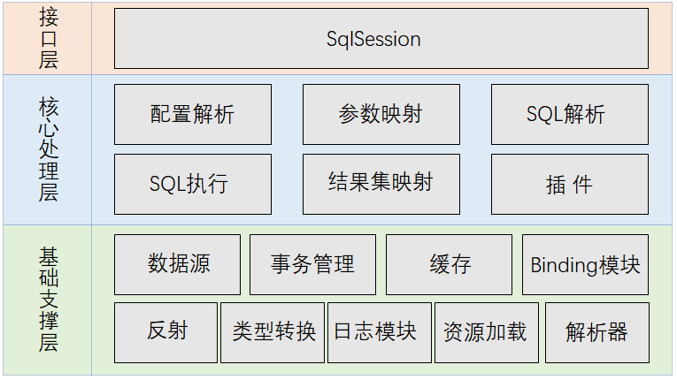
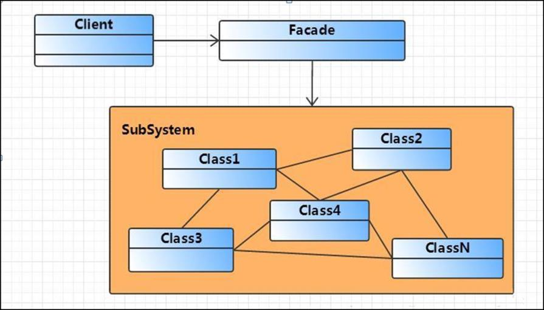
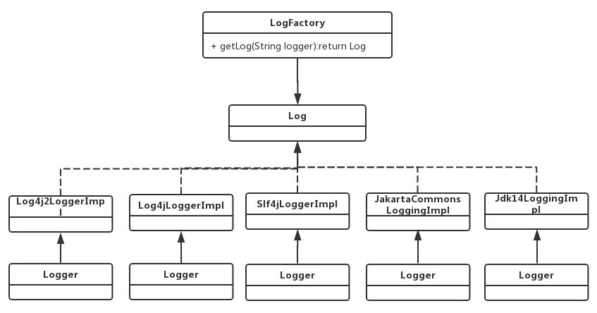
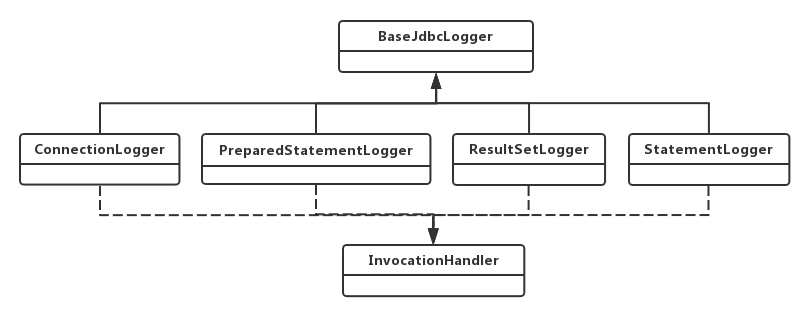

# MyBatis 源码笔记

## 1. MyBatis 源码概述
### 1.1. MyBatis 源码获取

MyBatis 源码下载地址：`https://github.com/MyBatis/MyBatis-3`

> 建议直接用`\第2期课程\（08）mybatis——lison老师\02-2019.08.27-摸了MyBtis的骨架，我才知道什么是骨骼惊奇（mybatis）\mybatis-3-master（注释版）.zip`的源码包，在里面加注释

源码包导入过程：

1. 下载 MyBatis 的源码
2. 检查 maven 的版本，必须是 3.25 以上，建议使用 maven 的最新版本
3. MyBatis 的工程是 maven 工程，在开发工具中导入，工程必须使用 jdk1.8 以上版本；
4. 把 MyBatis 源码的 pom 文件中`<optional>true</optional>`，全部改为 false；
5. 在工程目录下执行 mvn clean install -Dmaven.test.skip=true,将当前工程安装到本地仓库（pdf 插件报错的话，需要将这个插件屏蔽）；
    - > 注意：安装过程中会可能会有很多异常信息，只要不中断运行，请耐心等待；
6. 其他工程依赖此工程

### 1.2. 源码架构分析
#### 1.2.1. 物理分层



> 完整思维导图详见：D:\【Moon】\Java\编程资料思维导图\MyBatis源码结构.xmind

#### 1.2.2. 逻辑分层

MyBatis 源码共 16 个模块，可以分成三层



- 基础支撑层：技术组件专注于底层技术实现，通用性较强无业务含义；
- 核心处理层：业务组件专注 MyBatis 的业务流程实现，依赖于基础支撑层；
- 接口层：MyBatis 对外提供的访问接口，面向 SqlSession 编程；

> 拓展思考问题：系统为什么要分层？
>
> 1. 代码和系统的可维护性更高。系统分层之后，每个层次都有自己的定位，每个层次内部的组件都有自己的分工，系统就会变得很清晰，维护起来非常明确；
> 2. 方便开发团队分工和开发效率的提升；举个例子，mybatis 这么大的一个源码框架不可能是一个人开发的，他需要一个团队，团队之间肯定有分工，既然有了层次的划分，分工也会变得容易，开发人员可以专注于某一层的某一个模块的实现，专注力提升了，开发效率自然也会提升
> 3. 提高系统的伸缩性和性能。系统分层之后，只要把层次之间的调用接口明确了，那就可以从逻辑上的分层变成物理上的分层。当系统并发量吞吐量上来了，怎么办？为了提高系统伸缩性和性能，可以把不同的层部署在不同服务器集群上，不同的组件放在不同的机器上，用多台机器去抗压力，这就提高了系统的性能。压力大的时候扩展节点加机器，压力小的时候，压缩节点减机器，系统的伸缩性就是这么来的

### 1.3. 外观模式（门面模式）

从源码的架构分析，特别是接口层的设计，MyBatis的整体架构的设计模式符合外观模式

门面模式定义：提供了一个统一的接口，用来访问子系统中的一群接口。外观模式定义了一个高层接口，让子系统更容易使用。类图如下：



- **Facade 角色**：提供一个外观接口，对外，它提供一个易于客户端访问的接口，对内，它可以访问子系统中的所有功能。
- **SubSystem（子系统）角色**：子系统在整个系统中可以是一个或多个模块，每个模块都有若干类组成，这些类可能相互之间有着比较复杂的关系

门面模式优点：使复杂子系统的接口变的简单可用，减少了客户端对子系统的依赖，达到了解耦的效果；遵循了 OO 原则中的迪米特法则，对内封装具体细节，对外只暴露必要的接口。

- 门面模式使用场景：
    - 一个复杂的模块或子系统提供一个供外界访问的接口
    - 子系统相对独立，外界对子系统的访问只要黑箱操作即可

### 1.4. 面向对象设计需要遵循的六大设计原则

> 学习源码除了学习编程的技巧、经验之外，最重要的是学习源码的设计的思想以及设计模式的灵活应用

1. **单一职责原则**：一个类或者一个接口只负责唯一项职责，尽量设计出功能单一的接口；
2. **依赖倒转原则**：高层模块不应该依赖低层模块具体实现，解耦高层与低层。简单来说，既**面向接口编程**，当实现发生变化时，只需提供新的实现类，不需要修改高层模块代码
3. **开放-封闭原则**：程序对外扩展开放，对修改关闭；换句话说，当需求发生变化时，可以通过添加新模块来满足新需求，而不是通过修改原来的实现代码来满足新需求
4. **迪米特法则**：一个对象应该对其他对象保持最少的了解，尽量降低类与类之间的耦合度。实现这个原则，要注意以下两点：
    1. 在做类结构设计的时候尽量降低成员的访问权限，能用 private 的尽量用 private；
    2. 在类之间，如果没有必要直接调用，就不要有依赖关系；这个法则强调的还是类之间的松耦合；
5. **里氏代换原则**：所有引用基类（父类）的地方必须能透明地使用其子类的对象；
6. **接口隔离原则**：客户端不应该依赖它不需要的接口，一个类对另一个类的依赖应该建立在最小的接口上

## 2. 日志模块分析
### 2.1. 日志模块需求分析

1. MyBatis 没有提供日志的实现类，需要接入第三方的日志组件，但第三方日志组件都有各自的 Log 级别，且各不相同，而 MyBatis 统一提供了 trace、debug、warn、error 四个级别；
2. 自动扫描日志实现，并且第三方日志插件加载优先级如下：slf4J --> commonsLoging --> Log4J2 --> Log4J --> JdkLog;
3. 日志的使用要优雅的嵌入到主体功能中

### 2.2. 适配器模式

日志模块的第一个需求是一个典型的使用适配器模式的场景。

**适配器模式（Adapter Pattern）**是作为两个不兼容的接口之间的桥梁，将一个类的接口转换成客户希望的另外一个接口。适配器模式使得原本由于接口不兼容而不能一起工作的那些类可以一起工作；类图如下：


- Target：目标角色，期待得到的接口
- Adaptee：适配者角色，被适配的接口
- Adapter：适配器角色，将源接口转换成目标接口

适用场景：当调用双方都不太容易修改的时候，为了复用现有组件可以使用适配器模式；在系统中接入第三方组件的时候经常被使用到；

> 注意适配器使用的缺点：如果系统中存在过多的适配器，会增加系统的复杂性，设计人员应考虑对系统进行重构

- MyBatis 日志模块是怎么使用适配器模式？实现如下
    - Target：目标角色，期待得到的接口。org.apache.ibatis.logging.Log 接口，对内提供了统一的日志接口
    - Adaptee：适配者角色，被适配的接口。其他日志组件组件如 slf4J、commonsLoging、Log4J2 等被包含在适配器中。
    - Adapter：适配器角色，将源接口转换成目标接口。针对每个日志组件都提供了适配器，每个适配器都对特定的日志组件进行封装和转换；如 Slf4jLoggerImpl、JakartaCommonsLoggingImpl 等

日志模块适配器结构类图：



**总结：日志模块实现采用适配器模式，日志组件（Target）、适配器以及统一接口（Log 接口）定义清晰明确符合单一职责原则；同时，客户端在使用日志时，面向 Log 接口编程，不需要关心底层日志模块的实现，符合依赖倒转原则；最为重要的是，如果需要加入其他第三方日志框架，只需要扩展新的模块满足新需求，而不需要修改原有代码，这又符合了开闭原则**


### 2.3. 怎么实现优先加载日志组件

见 org.apache.ibatis.logging.LogFactory 中的静态代码块，通过静态代码块确保第三方日志插件加载优先级如下：slf4J → commonsLoging → Log4J2 → Log4J → JdkLog。在`tryImplementation`方法，会判断适配器的构造方法是否为空，为空时才会执行

```java
public final class LogFactory {
  ...
  // 被选定的第三方日志组件适配器的构造方法
  private static Constructor<? extends Log> logConstructor;

  // 自动扫描日志实现，并且第三方日志插件加载优先级如下：slf4J → commonsLoging → Log4J2 → Log4J → JdkLog
  static {
    tryImplementation(LogFactory::useSlf4jLogging);
    tryImplementation(LogFactory::useCommonsLogging);
    tryImplementation(LogFactory::useLog4J2Logging);
    tryImplementation(LogFactory::useLog4JLogging);
    tryImplementation(LogFactory::useJdkLogging);
    tryImplementation(LogFactory::useNoLogging);
  }
  ......

  private static void tryImplementation(Runnable runnable) {
    // 当构造方法不为空才执行方法
    if (logConstructor == null) {
      try {
        runnable.run();
      } catch (Throwable t) {
        // ignore
      }
    }
  }

  // 通过指定的log类来初始化构造方法
  private static void setImplementation(Class<? extends Log> implClass) {
    try {
      Constructor<? extends Log> candidate = implClass.getConstructor(String.class);
      Log log = candidate.newInstance(LogFactory.class.getName());
      if (log.isDebugEnabled()) {
        log.debug("Logging initialized using '" + implClass + "' adapter.");
      }
      logConstructor = candidate;
    } catch (Throwable t) {
      throw new LogException("Error setting Log implementation.  Cause: " + t, t);
    }
  }
  .....
}
```

### 2.4. 代理模式和动态代理(知识回顾)

- 代理模式定义：给目标对象提供一个代理对象，并由代理对象控制对目标对象的引用；
- 目的：
    1. 通过引入代理对象的方式来间接访问目标对象，防止直接访问目标对象给系统带来的不必要复杂性；
    2. 通过代理对象对原有的业务增强；
- 代理模式类图


- 代理模式有**静态代理**和**动态代理**两种实现方式

#### 2.4.1. 静态代理

- 静态代理方式需要代理对象和目标对象实现一样的接口
- 优点：可以在不修改目标对象的前提下扩展目标对象的功能
- 缺点：
    - 冗余。由于代理对象要实现与目标对象一致的接口，会产生过多的代理类
    - 不易维护。一旦接口增加方法，目标对象与代理对象都要进行修改

#### 2.4.2. 动态代理

- 动态代理利用了 JDK API，动态地在内存中构建代理对象，从而实现对目标对象的代理功能
- 动态代理又被称为 JDK 代理或接口代理。静态代理与动态代理的区别主要在
    1. 静态代理在编译时就已经实现，编译完成后代理类是一个实际的 class 文件
    2. 动态代理是在运行时动态生成的，即编译完成后没有实际的 class 文件，而是在运行时动态生成类字节码，并加载到 JVM 中
- **注意：动态代理对象不需要实现接口，但是要求目标对象必须实现接口，否则不能使用动态代理**

JDK 中生成代理对象主要涉及两个类/接口

- 第一个为 `java.lang.reflect.Proxy` 类，通过静态方法 `newProxyInstance` 生成代理对象
- 第二个为 `java.lang.reflect.InvocationHandler` 接口，通过 `invoke` 方法对业务进行增强

### 2.5. 优雅的增强日志功能

通过观察Mybatis框架的日志打印信息，总结框架对如下几个位置需要打日志：

1. 在创建 prepareStatement 时，打印执行的 SQL 语句；
2. 访问数据库时，打印参数的类型和值
3. 查询出结构后，打印结果数据条数

因此Mybatis框架在日志模块中有 BaseJdbcLogger、ConnectionLogger、PreparedStatementLogger 和 ResultSetLogger 通过动态代理负责在不同的位置打印日志；几个相关类的类图如下：



- `BaseJdbcLogger`：所有日志增强的抽象基类，用于记录 JDBC 那些方法需要增强，保存运行期间 sql 参数信息
- `ConnectionLogger`：负责打印连接信息和 SQL 语句。通过动态代理，对 connection 进行增强，如果是调用 prepareStatement、prepareCall、createStatement 的方法，打印要执行的 sql 语句并返回 prepareStatement 的代理对象（PreparedStatementLogger），让prepareStatement 也具备日志能力，打印参数
- `PreparedStatementLogger`：对 prepareStatement 对象增强，增强的点如下：
    - 增强 PreparedStatement 的 setxxx 方法将参数设置到 columnMap、columnNames、columnValues，为打印参数做好准备
    - 增强 PreparedStatement 的 execute 相关方法，当方法执行时，通过动态代理打印参数,返回动态代理能力的 resultSet
    - 如果是查询，增强 PreparedStatement 的 getResultSet 方法，返回动态代理能力的 resultSet；如果是更新，直接打印影响的行数
- `ResultSetLogger`：负责打印数据结果信息
- `StatementLooger`：与PreparedStatementLogger一样，只是打印没有预编译的SQL语句


#### 2.5.1. 日志功能是如何加入主体功能中

既然在 Mybatis 中 Executor 才是访问数据库的组件，日志功能是在 Executor 中被嵌入的，具体代码在`org.apache.ibatis.executor.SimpleExecutor.prepareStatement(StatementHandler, Log)`方法中


## 3. 数据源模块分析

数据源模块重点：数据源的创建和数据库连接池（*池化技术*）的源码分析；数据源创建比较复杂，对于复杂对象的创建，可以考虑使用工厂模式来优化，接下来介绍下简单工厂模式和工厂模式

### 3.1. 简单工厂模式

### 3.2. 工厂模式

### 3.3. 数据源的创建

数据源对象是比较复杂的对象，其创建过程相对比较复杂，对于 MyBatis 创建一个数据源，具体来讲有如下难点

1. 常见的数据源组件都实现了 `javax.sql.DataSource` 接口
2. MyBatis 不但要能集成第三方的数据源组件，自身也提供了数据源的实现
3. 一般情况下，数据源的初始化过程参数较多，比较复杂
- 综上所述，数据源的创建是一个典型使用工厂模式的场景，实现类图如下所示

**需求补充工厂模式的类图**

- `DataSource`：数据源接口，JDBC 标准规范之一，定义了获取获取 Connection 的方法
- `UnPooledDataSource`：不带连接池的数据源，获取连接的方式和手动通过 JDBC 获取连接的方式是一样的
- `PooledDataSource`：带连接池的数据源，提高连接资源的复用性，避免频繁创建、关闭连接资源带来的开销
- `DataSourceFactory`：工厂接口，定义了创建 Datasource 的方法
- `UnpooledDataSourceFactory`：工厂接口的实现类之一，用于创建 UnpooledDataSource(不带连接池的数据源)
- `PooledDataSourceFactory`：工厂接口的实现类之一，用于创建 PooledDataSource（带连接池的数据源）


